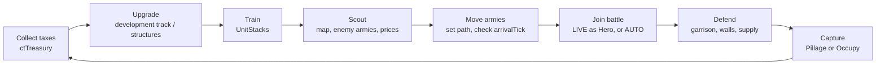

# 00 — Vision & Product

> **Elevator pitch:** Clash Front is a single persistent world where players build nations, own
> territory as Land NFTs, march real armies across a hex map in real time, and personally drop into
> the battles their strategy creates. The world never resets. Every battle changes the map.
> *Use Your Strength to Change the World.*

---

## 1. North Star

**The macro game must matter more than any individual battle.**

This is the Design North Star defined in [`README.md`](./README.md#design-north-star) and enforced by
the [11 Macro Pillars](./README.md#the-11-macro-pillars-non-negotiable) (canonical there — not
restated here). The practical consequence for every product decision:

- Winning a `LIVE` battle is worth less than arriving with Supply intact, on time, at the right hex.
- A player who never touches EF MOBA combat can still be a top-tier power (Governor, Landlord, Diplomat).
- Hero contribution to any battle is clamped at `HERO_IMPACT_MAX = 0.20`. Armies (≥ 80%) win wars.
- Nothing in Clash Front is instanced or reset. `Territory` records are never hard-deleted
  (invariant 7, [`08-data-models.md`](./08-data-models.md#5-invariants-must-always-hold)).

If a feature proposal makes one battle matter more than the map, reject it.

---

## 2. The Ether Fantasy ecosystem

Clash Front is one of four connected EF products (canonical table in
[`README.md`](./README.md#the-ether-fantasy-ecosystem)):

| Product | Fantasy | Tagline | What it contributes to Clash Front |
|---------|---------|---------|-----------------------------------|
| **EF Mobile** | Discovery | *Begin Your Journey* | Onboarding funnel; account + wallet creation |
| **EF Hunt** | Growth | *Live the Story. Become Stronger.* | Story, PvE, wild zones & bosses (see [`05-pve-integration.md`](./05-pve-integration.md)) |
| **EF MOBA** | Mastery | *Prove Your Skill.* | The `LIVE` Resolution Mode — hero drop-in combat (see [`04-battle-system.md`](./04-battle-system.md)) |
| **Clash Front** | Influence | *Use Your Strength to Change the World.* | The persistent map everything else acts upon |

**Shared spine across all four:**

- **Shared identity** — one `Player` account; the same handle everywhere.
- **Shared CT wallet** — **CT (Carat)** is the single hard currency ecosystem-wide, ledgered
  double-entry (`LedgerEntry`) and on-chain settleable.
- **Shared Heroes** — the `Hero` you master in EF MOBA and grow in EF Hunt is the officer you attach
  to an `Army` in Clash Front (`Hero.efMobaProfileId` links the accounts). Clash Front does **not**
  permanently level heroes; it grants **fame**, titles, and equipment bounded by `HERO_IMPACT_MAX`.

Narrative flow: **Begin Your Journey → Become Stronger → Prove Yourself → Change the World.**
Clash Front is the destination product: the place where accumulated skill and wealth become
*consequence*.

---

## 3. Player fantasies & archetypes

Clash Front must serve all eight simultaneously; each maps to canonical systems. Ownership ≠ control
(Pillar 11) is what makes several of these coexist on the same territory.

| Archetype | Daily activity | Optimizes | Monetizes |
|-----------|---------------|-----------|-----------|
| **Landlord** | Checks Prosperity of owned `LandNFT`s; negotiates `Lease`s; buys/sells listed NFTs | Prosperity of holdings (yield scales with it, not mere ownership — Pillar 10); `taxSplitLandlord` terms | NFT purchase/trade; rent (`rentCtPerDay`); tax share (default 30%) |
| **Governor** | Collects Tax to `ctTreasury`; upgrades development tracks (`AGRICULTURE/ECONOMY/DEFENSE/MILITARY`); manages Food, Population, Morale | Territory output per tick; rebellion avoidance; garrison readiness | CT spent on build/upgrade/repair; leases land they don't own |
| **General** | Trains `UnitStack`s, forms Armies, plans marches around travel time and Supply range | Force concentration, timing (`arrivalTick`), supply lines, veterancy | CT on training/upkeep; hero equipment (capped) |
| **Mercenary** | Browses `Contract` board; takes `MERCENARY_DEFEND` / `MERCENARY_ATTACK` / `ESCORT_SUPPLY` jobs | rewardCt per hour of march time; reputation for better contracts | Earns CT from other players; sink-free player-to-player flow |
| **Hero-for-hire** | Joins `LIVE` Battle Instances as a `BattleParticipant` for pay or `BOUNTY_HERO` targets | EF MOBA skill; fame; picking winnable fights within the 20% cap | Battle pay, bounties; cosmetics & equipment |
| **Diplomat** | Manages `DiplomacyRelation`s: truces, alliances, vassalage tribute (`tributeCtPerDay`) | Stance web value; wars won without marching | Tribute income; brokered `TRADE_LEASE` deals |
| **Raider** | Scouts weak, rich territories; strikes supply trains; chooses **Pillage** post-victory | Loot CT per raid; hit-and-run vs. retaliation risk (Pillar 9) | Instant `lootCt`; fences gains through trade |
| **Empire-builder** | Chooses **Occupy (Seize)**; integrates conquests; extends supply sources and Routes | Long-run yield, contiguous supply networks, region control | Largest cumulative CT spend: build + train + repair at scale |

Every archetype must have a reason to log in daily and a way to hurt or help every other archetype —
the Raider preys on the Empire-builder, who hires the Mercenary, who is watched by the Diplomat.

---

## 4. "What do I do today?" — the daily loop

The loop is deliberately *interruptible*: because armies march in real time
(`TRAVEL_ADJACENT_MIN = 15` min, `TRAVEL_REGION_HOURS = 3`, `TRAVEL_OCEAN_HOURS = 12`), every step
ends with something scheduled for later — which is the retention hook. You leave the app with a
reason to return.

---

## 5. Session cadence: async persistent world

One shard, one authoritative simulation (`World`), ticking at `TICK_SECONDS = 60`. Nothing waits for
you, and nothing needs you online to progress — but presence is rewarded.

**10-minute session (commute):**
1. Collect tax, read overnight event log (battles resolved `AUTO`, prosperity changes).
2. Queue one upgrade, one training batch.
3. Issue or adjust one march order; timings mean it resolves hours later.
4. Post or accept a `Contract`; check the NFT market.

**2-hour session (evening):**
- Everything above, plus: coordinate an alliance push timed to `scheduledStartTick`; sit in a battle
  `LOBBY` and fight the `LIVE` siege personally via EF MOBA; run diplomacy negotiations; micro-manage
  supply trains during an active offensive; shop leases and land auctions.

**Design rule:** no core loop action may *require* real-time presence except opting into a `LIVE`
battle. Defenders get scheduling windows (see [`04-battle-system.md`](./04-battle-system.md)) so
offline players are represented by `AUTO` resolution and garrisons, never simply deleted.

---

## 6. Design influences

### Romance of the Three Kingdoms — governance, logistics, officers
**Borrow:** territory administration as a game in itself (the four development tracks, Population,
Food, civil Morale); Heroes as *officers* attached to armies rather than solo super-units; the
emotional weight of named characters serving factions. **Reject:** turn-based pacing; officer stat
inflation over decades of sequels — our heroes don't permanently level in Clash Front.

### EVE Online — travel time, territorial ownership, single shard
**Borrow:** one persistent shard where distance is a weapon; territory as capital worth real money;
player politics as endgame content; "wars are won in spreadsheets and logistics." **Reject:** the
brutal onboarding cliff (EF Mobile/Hunt are the ramp); permanent full-loss for casual players;
requiring hours-long presence to matter.

### Foxhole — persistent war, supply
**Borrow:** supply as gameplay, not flavor — armies with cut supply lose `SUPPLY_BREAK_PENALTY = 35%`
combat power; logistics players (ESCORT_SUPPLY contracts, Supply Trains) as first-class heroes;
front lines that persist across sessions. **Reject:** manual hauling tedium — logistics here is
strategic routing, not truck-driving minutes; world resets at war end (our world *never* resets).

### League of Legends — hero-controlled drop-in battles
**Borrow:** skill-expressive, mastery-driven hero combat (delivered wholesale by EF MOBA in `LIVE`
mode); readable champion fantasy. **Reject:** the lobby model — battles here are *spawned by the
map* with real stakes, not matchmade; and hero skill can never decide more than `HERO_IMPACT_MAX`
of the outcome, because macro must matter more.

### Clash of Clans — base building & siege
**Borrow:** legible upgrade paths and structure levels (`StructureState`); the attack/defend siege
fantasy; short-session queue management. **Reject:** instanced "shadow" attacks against copies —
sieges here hit the *real* territory, destroy real `hp`, and the loser's map actually changes;
also reject troop-donation-as-only-social — our social layer is diplomacy, leases, and contracts.

---

## 7. Monetization & web3 — principled and specific

**Principles (in order): fair play → real ownership → circulation over extraction.**

1. **Land NFTs earn from Prosperity, not ownership** (Pillar 10). Yield = tax share
   (`TAX_SPLIT_LANDLORD_DEFAULT = 0.30`) of a territory whose income scales with its 0–100
   Prosperity. Idle, war-torn, or badly governed land yields little — landlords are incentivized to
   find good Governors (leases), not to squat. 1 Territory = 1 Land NFT, never orphaned.
2. **CT is the single currency.** All build/train/upgrade/repair/trade flows through CT with a
   conserved double-entry ledger (invariant 1). No secondary premium currency, no energy meters.
3. **Cosmetics & hero equipment.** Skins, titles, and equipment sell — but equipment only moves
   HeroImpact *within* the `HERO_IMPACT_MAX = 0.20` clamp (invariant 4). Spend can polish the top
   20%; it can never buy the 80% that is ArmyStrength, Supply, Terrain, and Morale.
4. **Contracts & mercenary economy.** `MERCENARY_DEFEND/ATTACK`, `BOUNTY_HERO`, `ESCORT_SUPPLY`,
   `TRADE_LEASE` are player-to-player CT circulation — the house takes a small fee (a CT sink), not
   a margin on power.
5. **Anti-pay-to-win firewall.** A whale can buy land, cosmetics, and mercenaries' *time* — all of
   which other players earn from. They cannot buy troop strength, travel speed, supply immunity, or
   an uncapped hero. The whale who ignores logistics still loses the war (North Star).

---

## 8. Success metrics (macro-game KPIs)

| KPI | Target / healthy signal | Why it proves the macro matters |
|-----|------------------------|--------------------------------|
| D1 / D7 / D30 retention | ≥ 45% / 22% / 10% (genre-competitive) | The "return for the arrival" hook works |
| Territory turnover | 3–8% of territories change `governorId` per week | Map is alive; not locked by incumbents, not chaotic |
| War participation | ≥ 30% of WAU touch a `BattleInstance` per week (any role, incl. `AUTO` stakes) | War is the content, not a niche |
| `LIVE` vs `AUTO` ratio | 10–25% of battles go `LIVE` | Drop-in is a highlight, not a requirement |
| NPC-vs-player territory ratio | From `LAUNCH_NPC_TERRITORY_PCT = 0.95` at launch → ~50–60% player-controlled by month 12, never below ~30% NPC | Players expand into a living world; NPC kingdoms keep frontiers hot (Pillar 8) |
| Non-combat earners | ≥ 25% of players' CT income from tax/lease/contracts/trade | Landlord/Governor/Diplomat fantasies are viable |
| Median session actions | ≥ 4 loop steps per 10-min session | The daily loop is completable in a commute |
| CT sink/source ratio | 0.9–1.1 rolling 30-day | Economy neither inflates nor strangles (see §9) |

---

## 9. Risks & mitigations

| Risk | Failure mode | Mitigations |
|------|-------------|-------------|
| **Whales dominate** | Spend buys map control; F2P churns | `HERO_IMPACT_MAX` clamp; power comes from Population/Food/Supply which take time & governance, not CT alone; ownership ≠ control means bought land still needs governing; coalition tools (contracts, `BOUNTY_HERO`, alliances) let the map gang up on a giant |
| **Empty map** | World feels dead between player hotspots | Launch at 95% NPC territory; NPC Kingdoms fight, expand, collapse 24/7 ([`06-ai-architecture.md`](./06-ai-architecture.md)); EF Hunt wild zones & bosses populate `WILD` hexes; contract board injects destinations |
| **Macro ignored** | Game degrades into a MOBA lobby with a map skin | North Star review gate on every feature; ≥ 80% of War Score from army/supply/terrain/morale; travel time & supply make *positioning* the dominant skill; KPIs in §8 monitored per release |
| **Economy inflation** | CT floods in from pillage/NPC farms; land yields devalue | Conserved ledger (mint-only issuance, auditable); strong sinks: build, train, **repair** (siege damage is a sink generator), contract fees; `PILLAGE_INFRA_LOSS = 0.50` means raiding destroys more value than it loots; balance knobs live in versioned `balance.json` |
| **Landlord absenteeism** | NFT holders squat; territories rot | Prosperity-gated yield (idle land pays ~nothing); lease market makes delegation profitable; SYSTEM-owned NFTs remain buyable so supply isn't cornered |
| **Defender's-offline griefing** | Night raids feel unfair, churn defenders | Battle scheduling windows + `LOBBY` phase; `AUTO` resolution respects garrisons, walls (`DEFENSE` track), and supply — a prepared absent defender wins prepared fights |

---

## Cross-references

- [`README.md`](./README.md) — North Star, 11 Macro Pillars, ecosystem table, canonical glossary
- [`01-world-simulation.md`](./01-world-simulation.md) — hex map, travel time, supply, seasons
- [`02-economy.md`](./02-economy.md) — CT flows, Prosperity, tax, Land NFT economy, sinks/sources
- [`03-military.md`](./03-military.md) — armies, officers, upkeep, supply trains
- [`04-battle-system.md`](./04-battle-system.md) — scheduling, Resolution Modes, EF MOBA handoff
- [`05-pve-integration.md`](./05-pve-integration.md) — EF Hunt, wild zones, bosses
- [`06-ai-architecture.md`](./06-ai-architecture.md) — NPC Kingdom AI keeping the world alive
- [`08-data-models.md`](./08-data-models.md) — all constants, enums, schemas, invariants cited above
- [`10-development-roadmap.md`](./10-development-roadmap.md) — when each promise above ships
