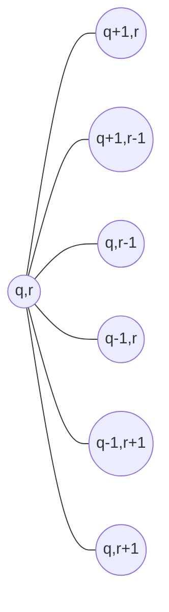

# 01 — World Simulation

> The persistent overworld: hex map, territories, travel, routes, logistics & supply, the world tick,
> morale & rebellion, seasons, and fog of war. All schemas and enums referenced here are canon from
> [`08-data-models.md`](./08-data-models.md); constants come from `CONSTANTS` there and tunables from
> `balance.json`. **This doc never redefines canonical terms — it wires them together.**

The simulation is a single authoritative loop advancing the `World` one tick every
`TICK_SECONDS` (60 s). Everything a player perceives as "the living world" — armies marching,
supply lines stretching and snapping, rebellions flaring — is the visible output of this loop.
Pillars #2 (travel time), #3 (supply lines), and #6 (battles change the map) live here.

---

## 1. Hex map model

### 1.1 Axial coordinates & adjacency

The atomic map cell is the `Hex` (`hex_…`), addressed by **axial coordinates** `(q, r)` on a
pointy-top grid. Implied cube coordinate: `s = -q - r`. Distance:

```
hexDistance(a, b) = (|a.q - b.q| + |a.r - b.r| + |a.s - b.s|) / 2
```

Every hex has exactly six neighbors via fixed axial offsets:

```
NEIGHBOR_OFFSETS = [(+1,0), (+1,-1), (0,-1), (-1,0), (-1,+1), (0,+1)]

            ( 0,-1)  (+1,-1)
        (-1, 0)  (q,r)  (+1, 0)
            (-1,+1)  ( 0,+1)
```



### 1.2 Terrain, land vs sea, Territories, Regions

Each hex carries a `HexTerrain` and a base `moveCost` multiplier (1.0 = baseline). Suggested
defaults (tunable in `balance.json`):

| HexTerrain | moveCost | Passable by land army | Notes |
|---|---|---|---|
| `PLAINS` | 1.0 | yes | baseline |
| `ROAD` | 0.5 | yes | built/upgraded; see §4 |
| `FOREST` | 1.5 | yes | ambush bonus (§3.4), vision penalty (§9) |
| `HILLS` | 1.5 | yes | defender terrain bonus (see [`04-battle-system.md`](./04-battle-system.md)) |
| `MOUNTAIN` | 3.0 | yes (no `SIEGE`/`SHIP`) | chokepoints |
| `RIVER` | 2.0 | yes | crossing penalty; bridges = `ROAD` overlay |
| `COAST` | 1.0 | yes | embark/disembark point; `HARBOR` zones sit here |
| `OCEAN` | 1.0 (naval) | **no** — naval only | requires ships/sea lane |

**Land vs sea:** an `Army` without `SHIP` units may never occupy an `OCEAN` hex. Embarking
requires a friendly `HARBOR` territory or `COAST` hex with transport capacity; while embarked the
army moves on the naval graph. `SEA` **Territories** (patches of `OCEAN`/`COAST` hexes) are
controllable zones — holding one lets the governor tax and blockade the sea lanes crossing it.

**Territories map to hexes** via `Territory.hexIds` (1..n hexes; `Hex.territoryId` is the reverse
pointer, `undefined` for open-sea/wild filler hexes that belong to no NFT). One Territory = one
Land NFT (canon invariant 2). A territory's *seat hex* (first entry of `hexIds`) is where sieges
resolve and garrisons sit. A `Region` is a named cluster of territories/hexes (`Region.hexIds`)
used for travel-time buckets (§3), weather (§8), and AI planning
([`06-ai-architecture.md`](./06-ai-architecture.md)).

---

## 2. ZoneTypes on the map

One-line function and placement rules for each `ZoneType`:

| ZoneType | Function | Placement / adjacency rules |
|---|---|---|
| `VILLAGE` | Food engine: high Agriculture yield, low defense. | On `PLAINS`/`RIVER`; ≥ 2 hexes from another VILLAGE; majority of land zones. |
| `TOWN` | Economy engine: markets, tax, recruitment. | On road junctions (≥ 2 `ROAD` edges preferred); upgraded from VILLAGE. |
| `FORTRESS` | Military anchor: `supplySource`, garrison, chokepoint control. | On `HILLS`/`MOUNTAIN`/`RIVER` chokepoints; never adjacent to another FORTRESS. |
| `HARBOR` | Sea gateway: embark/disembark, sea-lane terminus, naval supply. | Seat hex must be `COAST` adjacent to ≥ 1 `OCEAN` hex. |
| `CAPITAL` | Region seat: strongest yields, diplomacy hub, always `supplySource`. | Exactly one per `Region` (`Region.capitalTerritoryId`); interior, road-connected to ≥ 2 TOWNs. |
| `WILD` | PvE space: monsters, bosses, unclaimed nodes ([`05-pve-integration.md`](./05-pve-integration.md)). | Buffer between kingdoms; no population/tax until settled (zoneType flips, never deleted — invariant 7). |
| `SEA` | Controllable ocean zone: blockade, naval tax, lane control. | Composed of `OCEAN`/`COAST` hexes only. |

`supplySource` defaults: `CAPITAL` and `FORTRESS` true; `HARBOR` true while its sea lane to a
friendly CAPITAL/FORTRESS is open; others false unless a granary structure grants it
([`02-economy.md`](./02-economy.md)).

---

## 3. Movement & travel

### 3.1 Step cost and arrivalTick

Armies move **hex-to-hex** along a precomputed `path` (list of hexIds). The canonical baseline is
`TRAVEL_ADJACENT_MIN = 15` minutes per adjacent land hex. With `TICK_SECONDS = 60`:

```
BASE_STEP_TICKS = TRAVEL_ADJACENT_MIN * 60 / TICK_SECONDS   // = 15 ticks

stepTicks(army, hex) = ceil(
  BASE_STEP_TICKS
  * hex.moveCost                    // terrain + ROAD discount
  * armySpeedMod(army)              // slowest UnitClass in stack; SIEGE ≈ 1.5, CAVALRY-only ≈ 0.6
  * seasonMoveMod(region, season)   // balance.json, §8
)

arrivalTick(next hex) = currentTick + stepTicks(army, path[0])
```

On each arrival the engine pops `path[0]`, sets `hexId`, and computes the next `arrivalTick`. A
`MARCHING` army always has `path` and `arrivalTick` (invariant 8).

**Deriving the canonical baselines** (why the constants are what they are):

| Route type | Effective steps | Time | Canon constant |
|---|---|---|---|
| Adjacent land hex | 1 × 15 min | **15 min** | `TRAVEL_ADJACENT_MIN` |
| Cross-region march | ~12 hexes (typical Region diameter) × 15 min | **3 h** | `TRAVEL_REGION_HOURS` |
| Trans-ocean crossing | ~48 naval steps (sea-lane length × naval step) | **12 h** | `TRAVEL_OCEAN_HOURS` |

Map generation MUST honor these: Region diameters ≈ 10–14 hexes; inter-continental sea lanes sized
so a baseline fleet crosses in ≈ `TRAVEL_OCEAN_HOURS`. Distance is a weapon — a reinforcement 3 h
away is not in the battle (see lobby windows in [`04-battle-system.md`](./04-battle-system.md)).

### 3.2 Path resolution

Paths are computed with **A\*** over the hex graph, heuristic `hexDistance × min terrain cost`,
edge weight `= destination hex moveCost` (with Route discounts, §4). Land armies exclude `OCEAN`;
embarked armies use the naval graph. The path is **frozen at order time** (players can eyeball
ETAs); the engine re-paths only when a step becomes illegal (route destroyed, blockade raised,
hostile ZoC — below). Re-path failure ⇒ army halts in place, state stays `MARCHING` with empty
path pending new orders, and its supply clock keeps running (§5).

### 3.3 Marching visibility & scouting

A `MARCHING` army is an event source: it is visible to any observer whose vision (§9) covers its
current hex, and its **heading is inferable** (observers see current hex + last-entered edge, not
the full path or destination). Dedicated scout detachments (small `CAVALRY` armies) trade combat
power for +2 vision radius and faster steps — the intended counter to fog.

### 3.4 Interception & ambush windows

- **Zone of control (ZoC):** entering a hex adjacent to a hostile army lets that army contest the
  step. Contest ⇒ the mover's step completes, then a `FIELD` `BattleInstance` is scheduled at the
  contested hex (both armies `ENGAGED`).
- **Interception:** any hostile army whose recomputed ETA to a hex on the mover's remaining path
  is `≤` the mover's arrivalTick there may set an intercept order; if both occupy the hex on the
  same tick, a FIELD battle spawns.
- **Ambush:** an army `GARRISON`-idle in `FOREST`/`HILLS` and unseen at contest time gets an
  ambush opening (first-strike WarScore bonus, tuned in `balance.json`).
- Battles at sea between embarked forces are `NAVAL`.

---

## 4. Routes: roads & sea lanes

A `Route` (canon: traversable connection with a movement-cost weight) is the strategic skeleton of
the map:

- **Roads** overlay land hexes as `ROAD` terrain (`moveCost 0.5`), built with CT along a chosen
  hex path ([`02-economy.md`](./02-economy.md)). A road halves both march time **and** supply
  distance (§5.2), which is why the same road that feeds your army guides the enemy to your
  capital.
- **Sea lanes** connect `HARBOR` ⇄ `HARBOR` (or HARBOR ⇄ SEA-zone waypoints) across `OCEAN`
  hexes at naval baseline cost. No lane ⇒ open-ocean travel at a `balance.json` penalty (e.g. ×2).

**Why routes are targets:** cutting a road (raiding its hexes back to base terrain, or simply
holding a hex on it with a hostile army) and blockading a harbor (hostile fleet occupying its
adjacent `OCEAN` hexes, or hostile control of the `SEA` territory a lane crosses) do two things at
once — raise enemy `moveCost` and **remove edges from the friendly route graph used by the supply
check (§5.2)**. Escorting is a first-class job: `ESCORT_SUPPLY` contracts (see
[`08-data-models.md`](./08-data-models.md) `ContractType`).

---

## 5. Logistics & Supply Lines (flagship system)

Pillar #3. An army that outruns its logistics dies without a battle.

### 5.1 The supply stat

Every `Army` has `supply: 0..supplyMax` (`SUPPLY_MAX_DEFAULT = 100`). Supply abstracts fodder,
ammunition, and cohesion; **Food** (economy, [`02-economy.md`](./02-economy.md)) is consumed
separately as upkeep ([`03-military.md`](./03-military.md)).

### 5.2 "Is this army supplied?" — the graph check

Run each tick, in tick phase 4 (§6):

```
function isSupplied(army):
  // Dijkstra over the FRIENDLY-CONTROLLED route graph, seeded at the army's hex.
  // An edge (hexA → hexB) is usable iff:
  //   - hexB is passable and NOT occupied/ZoC'd by a hostile army
  //   - hexB.territoryId is undefined(wild) OR controlled by the army's governor,
  //     an ALLIED governor, or a SUZERAIN/VASSAL partner (DiplomacyStance)
  //   - sea edges require an open sea lane (no blockade) and friendly HARBOR endpoints
  // Edge weight = hexB.moveCost  (ROAD = 0.5 → roads DOUBLE effective supply reach)
  dist = dijkstra(army.hexId, friendlyRouteGraph)
  best = min over territories T with T.supplySource == true of dist[T.seatHex]
  range = SUPPLY_RANGE_HEXES                 // balance.json, default 10 weighted hexes
        + SUPPLY_TRAIN_RANGE_BONUS * count(army.supplyTrainIds where state != 'RAIDED')
  return best <= range                        // default bonus: +5 per active train
```

### 5.3 Per-tick supply flow

```
if isSupplied(army):
    army.supply = min(army.supplyMax, army.supply + SUPPLY_REGEN_PER_TICK)      // default +2
else:
    drain = SUPPLY_DRAIN_BASE                                                    // default 1
          + SUPPLY_DRAIN_PER_1000_TROOPS * totalTroops(army) / 1000
          * (army.state == 'MARCHING' ? MARCH_DRAIN_MULT : 1)                    // default ×2
          * seasonSupplyMod(region, season)                                      // winter bites
    army.supply = max(0, army.supply - drain)
```

At default tuning an idle cut-off 1000-troop army holds ~50 min before hitting 0; a marching one
~25 min — long enough to fight back to a road, short enough that encirclement wins wars.

### 5.4 Consequences of a cut line

While `supply == 0` the army is **BROKEN**:

1. **Combat:** effective combat power ×`(1 − SUPPLY_BREAK_PENALTY)` = ×0.65 in any WarScore
   (`breakdown['supply']`, [`04-battle-system.md`](./04-battle-system.md)).
2. **Morale:** −`MORALE_LOSS_UNSUPPLIED_PER_TICK` (default 1) per tick, floor `MORALE_MIN`.
3. **Desertion:** while `army.morale < DESERTION_MORALE_THRESHOLD` (25), each tick every
   `UnitStack` loses `ceil(count * DESERTION_RATE)` troops (default 0.5%/tick). Deserters vanish
   (a fraction may spawn WILD bandits, [`05-pve-integration.md`](./05-pve-integration.md)).
4. **Recovery:** regaining supply stops the bleed; morale recovers slowly (§7). Losses are gone.

**Supply Trains** (`SupplyTrain`) extend `range` (§5.2) but are near-defenseless map objects: a
hostile army reaching a train's hex sets `state:'RAIDED'`, instantly shrinking the owner's range —
often flipping `isSupplied` from true to false without a battle.

### 5.5 Raiding doctrine (the intended counterplay)

Everything above makes small-force logistics warfare viable against bigger armies:

- **Cut roads** — occupy/pillage a road hex: enemy marches slow *and* the Dijkstra loses the edge.
- **Block ports** — park a fleet on a HARBOR's ocean hexes: its sea lanes drop from the graph and
  the harbor loses `supplySource`.
- **Raid farms** — pillage `VILLAGE`s feeding the front: food upkeep fails
  ([`03-military.md`](./03-military.md)), compounding the supply squeeze.
- **Raid trains** — see §5.4.

A whale's death-stack that ignores this loses to three cheap cavalry bands. Working as intended.

---

## 6. The world tick loop

Every `TICK_SECONDS` the tick engine ([`07-backend-architecture.md`](./07-backend-architecture.md))
advances `World.tick` by exactly 1 through a **fixed order of phases**:

```
function worldTick(world, tick):
  # 1. PRODUCTION      territories: food/CT/prosperity yield; structures; nodes   (02)
  # 2. CONSUMPTION     population eats; army food upkeep; lease/tribute payments  (02,03)
  # 3. MOVEMENT        for each MARCHING army with arrivalTick <= tick:
  #                      advance hex, pop path, contest ZoC, set next arrivalTick (§3)
  # 4. SUPPLY          isSupplied() for every army; regen/drain; train raids      (§5)
  # 5. MORALE          army + civil morale deltas; desertion                      (§7, §5.4)
  # 6. REBELLION       rebellion-risk checks per territory; spawn rebel armies    (§7)
  # 7. BATTLE SPAWN    co-located hostiles / sieges → create BattleInstance,
  #                      set scheduledStartTick; apply resolved battle outcomes   (04)
  # 8. AI              NPC Kingdom governors + army AI issue next-tick orders     (06)
  persist(worldState, tick)        # write-through Redis → Postgres, emit events (07)
```

Rules that make this safe to operate:

- **Deterministic & replayable:** every phase reads the post-previous-phase state and any RNG
  draws from `PRNG(world.seed, tick, entityId)`. Replaying the event log from a snapshot
  reproduces the world bit-for-bit.
- **Idempotent:** `worldTick(world, N)` applied twice is a no-op the second time — every mutation
  is guarded by entity `version` and keyed to `tick` (at-least-once delivery tolerated).
- **Authoritative:** this loop is the only writer of sim state. Clients and AI submit *orders*;
  the tick validates and applies them. During `LIVE` battles EF MOBA is authoritative for the
  battle only; its `BattleResult` re-enters the world in phase 7. See
  [`07-backend-architecture.md`](./07-backend-architecture.md).
- Ordering rationale: production before consumption (invariant 5, no negative resources); movement
  before supply (you're judged where you *are*); supply before morale before rebellion (causes
  precede effects); AI last (acts on a settled world, effective next tick).

---

## 7. Morale & rebellion

Two bounded 0–100 scores (invariant 6): `Army.morale` and `Territory.morale` (civil).

**Army morale** — drops from: unsupplied ticks (§5.4), lost battles, forced retreats, extreme-season
marches. Rises from: victories, garrisoning a friendly supplied territory
(+`MORALE_REGEN_GARRISON_PER_TICK`, default +1 while supplied), hero fame aura (small, and always
inside `HERO_IMPACT_MAX` in combat). Below `DESERTION_MORALE_THRESHOLD` (25) ⇒ desertion (§5.4);
morale also enters WarScore `breakdown['morale']`.

**Civil morale & rebellion** — checked in tick phase 6:

```
risk = 0
if territory.foodStock <= REBELLION_FOOD_THRESHOLD: risk += RISK_FOOD          // starving, default +40
if governorId changed within OCCUPATION_GRACE_TICKS: risk += RISK_OCCUPATION   // fresh occupation, +20
if territory.prosperity < PROSPERITY_LOW_BAND:       risk += RISK_POVERTY      // default band 25, +15
risk *= (1 - territory.morale / 100)                 // content people don't rise
if PRNG(seed, tick, terr.id) < risk / RISK_SCALE:    spawnRebellion(territory)
```

A rebellion spawns a SYSTEM-governed rebel `Army` at the seat hex sized by `population`, halts all
yields, and besieges the garrison. Crushed ⇒ morale floor lingers; victorious ⇒ `governorId` flips
to a SYSTEM/NPC rebel governor — the Land NFT owner keeps the NFT (**ownership ≠ control**,
invariant 3), now earning nothing until someone retakes it. **Recovery:** civil morale regenerates
(default +1/tick) only while fed (`foodStock > 0`), not occupied-within-grace, and prosperity above
the low band. Occupiers who want yield must ship food in — pillage vs occupy is a real choice
(Pillar #9, [`02-economy.md`](./02-economy.md)).

---

## 8. Weather & seasons

Seasons give the world a strategic rhythm without new mechanics — they are **pure multipliers** in
`balance.json`, applied per Region each tick (season length: `SEASON_DAYS`, default 7 real days):

| Season | foodYieldMod | landMoveMod | navalMoveMod | supplyDrainMod |
|---|---|---|---|---|
| SPRING | 1.10 | 1.0 | 1.0 | 1.0 |
| SUMMER | 1.25 | 0.9 | 0.9 | 0.9 |
| AUTUMN | 1.00 | 1.0 | 1.1 | 1.0 |
| WINTER | 0.60 | 1.3 | 1.4 (storms) | 1.5 |

These feed `seasonMoveMod` (§3.1) and `seasonSupplyMod` (§5.3). Intended meta: campaign in summer,
harvest and stockpile in autumn, hold fortresses through winter — a winter invasion is possible
but is a logistics gamble by construction. Transient weather events (storms closing a sea lane for
N ticks) are the same mechanism at hex granularity and use the same modifier table.

> ❓ OPEN: exact seasonal values are Sim/Economy-owned tuning in `balance.json`; the table above is
> the seed proposal, not canon constants.

---

## 9. Fog of war / information model

Truth lives server-side; each governor holds a **known-world overlay**:

- **Always public:** hex geography/terrain, Territory names + `zoneType`, current `governorId`
  (banners are visible), Land NFT market listings, declared wars.
- **Vision (live, per-governor union):** controlled territories see radius by zone (`VILLAGE/TOWN`
  2, `FORTRESS/HARBOR` 3, `CAPITAL` 4 hexes); armies see 1 (scouts +2, §3.3); allies (`ALLIED`
  stance) pool vision. `FOREST`/`MOUNTAIN` hexes need adjacency to reveal contents.
- **Must be scouted (visible only inside vision):** army positions/headings, stack composition
  (coarse size bands at range, exact stacks only adjacent), supply trains, garrison strength,
  territory `foodStock`/`morale`/development levels.
- **Staleness:** out-of-vision intel freezes with a `lastSeenTick` and renders as ghosted; clients
  must display age. No API ever returns live data outside vision
  ([`09-api-contracts.md`](./09-api-contracts.md)).
- **Espionage/rumor systems** ride this overlay (buying another governor's intel = merging
  overlays); mechanics beyond vision-sharing are out of scope here.

---

## 10. Simulation invariants (per-tick checklist)

Asserted at the end of every tick; violations page the sim owner and quarantine the entity.
Numbers reference [`08-data-models.md` §5](./08-data-models.md#5-invariants-must-always-hold):

- [ ] **Bounded resources** — `population, foodStock, ctTreasury, supply ≥ 0` (inv. 5); `prosperity`, `morale` ∈ [0,100] (inv. 6).
- [ ] **Valid army positions** — every army's `hexId` exists; land armies never on `OCEAN` without ships; every `MARCHING` army has `path` + `arrivalTick > tick` or a pending halt order (inv. 8).
- [ ] **Path legality** — each stored `path` step is adjacent (axial offsets §1.1) and passable at order time.
- [ ] **Territory ↔ NFT integrity** — 1:1, no orphans (inv. 2); territories never hard-deleted (inv. 7).
- [ ] **Supply math sane** — `supply ≤ supplyMax`; `isSupplied` used only friendly/allied edges this tick.
- [ ] **Tick monotonicity** — `World.tick` increments by exactly 1; every mutation this tick carries this tick number (replayability §6).
- [ ] **CT conservation** — no phase minted CT outside a `reason:'mint'` ledger entry (inv. 1).
- [ ] **Battle spawning** — every SIEGE created references exactly one `defenderTerritoryId` (inv. 9).

---

## Cross-references

- [`README.md`](./README.md) — canon glossary, pillars, constants excerpt
- [`08-data-models.md`](./08-data-models.md) — `Hex`, `Territory`, `Army`, `SupplyTrain` schemas; enums; `CONSTANTS`; invariants
- [`02-economy.md`](./02-economy.md) — production/consumption phases, prosperity, tax, roads' CT cost
- [`03-military.md`](./03-military.md) — army composition, upkeep, supply trains as military assets
- [`04-battle-system.md`](./04-battle-system.md) — WarScore (supply/morale/terrain terms), battle scheduling
- [`05-pve-integration.md`](./05-pve-integration.md) — WILD zones, deserter bandits, bosses
- [`06-ai-architecture.md`](./06-ai-architecture.md) — NPC Kingdom decision-making in tick phase 8
- [`07-backend-architecture.md`](./07-backend-architecture.md) — tick engine, authority, persistence, event log
- [`09-api-contracts.md`](./09-api-contracts.md) — fog-of-war enforcement at the API boundary
