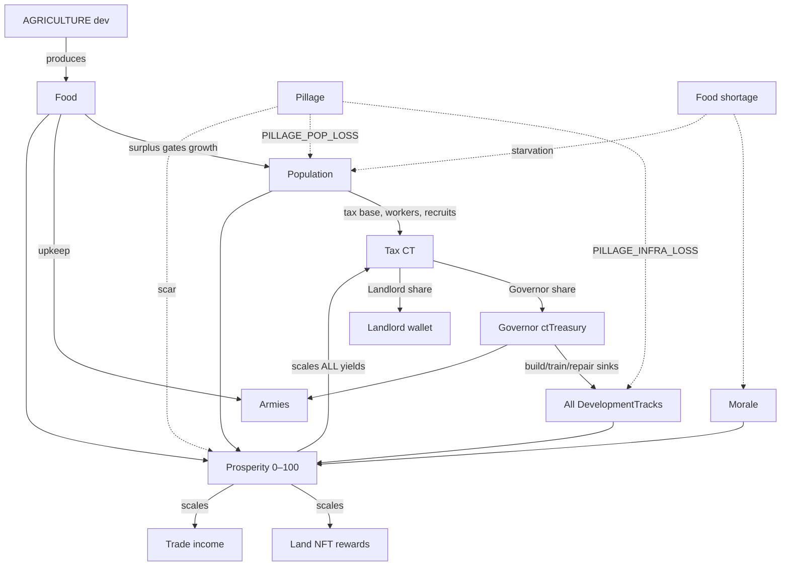

# 02 — Economy

> Owner: **Economy agent**. Canon terms and constants live in [`README.md`](./README.md) and
> [`08-data-models.md`](./08-data-models.md) — never redefined here, only referenced. All numeric
> **tuning values** in this doc (marked ⚙) are defaults for `balance.json` (versioned separately per
> the OPEN note in 08) and may be retuned without code changes. All **canonical constants**
> (`CT_UNITS_PER_CT`, `TAX_SPLIT_LANDLORD_DEFAULT`, …) may not.

The economy exists to make Pillar 1 true — *territory matters* — and Pillar 10 honest — *Land NFTs
earn from prosperity, not mere ownership*. A territory is a small engine: population eats food and
pays tax; tax funds development; development raises prosperity; prosperity scales everything.
Armies, pillage, and politics are the wrenches thrown into that engine.

---

## 1. The resource web



Every arrow is a formula below. The loop `Tax → Development → Prosperity → Tax` is the growth
flywheel; **Pillage** and **food shortage** are the two ways it breaks.

---

## 2. CT (Carat) — the single hard currency

CT is the only hard currency (see Glossary). Stored as **`ct_units`** integers,
`1 CT = CT_UNITS_PER_CT = 10_000` units. No floats for money, ever. `Player.ctBalance` and
`Territory.ctTreasury` are mirrors; the **append-only double-entry `LedgerEntry` table is the
authoritative truth** (invariant 08 §5.1).

| Sources (CT in) | Sinks (CT out, → `system:treasury`) | Transfers (player↔player, net zero) |
|---|---|---|
| `tax` (emission, §5) | `build` / `upgrade` development & structures | `pillage` loot, `bounty`, mercenary `Contract` payouts |
| `mint` (controlled emission events) | `train` units, `repair` structure HP | `lease` rent, NFT `trade` sale price |
| — | army upkeep, market/listing fees | tribute (`VASSAL_OF`), inter-player trade |

**Conservation invariant:** the sum of all balances derived from `LedgerEntry` equals total minted
CT; CT is created **only** by `reason:'mint'` entries into `system:treasury`. Tax payouts *draw
down* `system:treasury`; sinks *refill* it. Designers therefore control net inflation with one
lever: the mint schedule (§11).

### Example ledger flow — build order

Governor upgrades ECONOMY to level 4 (cost 491.52 CT = 4,915,200 ct_units, §7), funded 300 CT from
personal wallet + remainder from the territory treasury:

| # | fromAccount | toAccount | amountCt (ct_units) | reason | refId |
|---|---|---|---|---|---|
| 1 | `player_01H…GOV` | `terr_01H…AZUR` | 3,000,000 | `trade` | `order_…` (deposit) |
| 2 | `terr_01H…AZUR` | `system:treasury` | 4,915,200 | `build` | `order_…` |

### Example ledger flow — tax payout (one cycle, territory from §5)

| # | fromAccount | toAccount | amountCt (ct_units) | reason |
|---|---|---|---|---|
| 1 | `system:treasury` | `terr_01H…AZUR` | 2,080,000 | `tax` (gross 208 CT) |
| 2 | `terr_01H…AZUR` | `player_01H…LORD` | 624,000 | `tax` (landlord 30%) |
| 3 | `terr_01H…AZUR` | `player_01H…LORD` | −— see §5 lease variant — | `lease` |

Rows always balance; replaying the ledger reconstructs every balance.

---

## 3. Prosperity — the 0–100 health score

`Territory.prosperity` (bounded `PROSPERITY_MIN..PROSPERITY_MAX`) is the multiplier on *all*
economic output. Each tick the sim computes a **target** and moves prosperity toward it.

```
prosperity_target = clamp(0, 100,
    25·foodScore + 25·devScore + 20·moraleScore + 15·popScore + 15·peaceScore )

foodScore   = clamp01( foodStock / (7 · dailyFoodConsumption) )   // a week of food = 1.0
devScore    = Σ development[track] / (4 · MAX_DEV_LEVEL⚙10)
moraleScore = morale / 100
popScore    = clamp01( population / popCapacity )                  // §4
peaceScore  = 1 − pillageScar                                      // scar: 1.0 on pillage,
                                                                   // −0.02/hour⚙ decay (~2 days)
```

⚙ Per-tick movement (`TICK_SECONDS = 60`): **growth** `+1/60` per tick toward target (max +24/day);
**decay** `−2/60` per tick when above target (max −48/day). Collapse is twice as fast as recovery.

**Prosperity scales all yields:** tax (§5), trade income (§10), and food production softly
(`×(0.5 + 0.5·prosperity/100)` — half-weight, so starving territories don't death-spiral). **Land
NFT rewards are the landlord's tax share, which is prosperity-scaled** — an idle, unmanaged
territory drifts toward low prosperity and yields little (Pillar 10).

---

## 4. Population

Population produces tax (§5), caps worker throughput on builds, and caps recruitment
(soldierCapacity = ⚙`2% of population × (1 + 0.25·dev_MILITARY)`; see
[`03-military.md`](./03-military.md)).

**Growth (food-gated logistic), per day:**

```
popCapacity  = BASE_POP_CAP[zoneType]⚙ × (1 + 0.25 · dev_AGRICULTURE)
foodPopCap   = foodProductionPerDay / FOOD_PER_POP_PER_DAY⚙(0.1)
effectiveCap = min(popCapacity, foodPopCap)
ΔP/day       = r⚙(0.02) · P · (1 − P / effectiveCap)      // only if foodStock > 0
```

⚙ `BASE_POP_CAP`: VILLAGE 5,000 · TOWN 20,000 · HARBOR 15,000 · FORTRESS 8,000 · CAPITAL 50,000.

**Death & flight:**
- **Starvation** (`foodStock == 0`): −1%⚙ population/day, morale −5/day, rebellion risk (§6).
- **Pillage:** instant `population ×= (1 − PILLAGE_POP_LOSS)` → −25%.
- **Migration:** each day, ⚙0.5% of population drifts from territories with prosperity < 30 to the
  adjacent friendly territory with the highest prosperity (a soft reward for good governance).

*Worked example:* TOWN, P = 10,000, dev_AGRICULTURE = 4 → popCapacity = 40,000; food production
1,600/day → foodPopCap = 16,000; effectiveCap = 16,000. Growth = 0.02·10,000·(1 − 10,000/16,000) =
**+75 pop/day**. Agriculture, not walls, is the growth bottleneck — as intended.

---

## 5. Tax — the CT skim and the split

Every **tax cycle** (⚙`TAX_CYCLE_TICKS = 1_440` ticks = 24 h), each territory generates:

```
grossTaxCt = population × BASE_TAX_CT_PER_POP⚙(0.02 CT)
             × (prosperity / 100)
             × (1 + 0.10 · dev_ECONOMY)
```

The gross is drawn `system:treasury → terr` (reason `'tax'`), then split:

1. **Landlord** receives `grossTaxCt × LandNFT.taxSplitLandlord`
   (default `TAX_SPLIT_LANDLORD_DEFAULT = 0.30`; adjustable **per NFT** — a landlord courting a good
   governor can lower it; system-owned land uses the default).
2. **Governor** keeps the remainder in `Territory.ctTreasury`.
3. **Lease (if `LandNFT.leaseId` set):** lessee pays `Lease.rentCtPerDay` to the landlord
   (reason `'lease'`) and receives `Lease.revenueSharePct` of the **landlord's** tax share back.

**Worked cycle** — TOWN "Azure Bay": population 10,000, prosperity 80, dev_ECONOMY 3:

| Line | Formula | CT | ct_units |
|---|---|---|---|
| Gross tax | 10,000 × 0.02 × 0.80 × 1.30 | **208.00** | 2,080,000 |
| Landlord (30%) | 208 × 0.30 | 62.40 | 624,000 |
| Governor (70%) | 208 × 0.70 | 145.60 | 1,456,000 |
| *Lease variant:* lessee has 50% revenueShare | 62.40 × 0.50 back to lessee | 31.20 | 312,000 |
| *…and pays rent* | `rentCtPerDay` = 40 | −40.00 | −400,000 |

Under the lease the landlord nets 62.40 − 31.20 + 40.00 = **71.20 CT/day** — better than the bare
30% *because* the lessee develops the land. That is the intended deal shape.

---

## 6. Food & agriculture

```
foodProdPerDay    = FOOD_BASE_PER_LEVEL⚙(400) × dev_AGRICULTURE
                    × terrainMult × seasonMult              // see 01-world-simulation.md
                    × (0.5 + 0.5 · prosperity/100)
foodConsPerDay    = population × 0.1  +  Σ garrisoned/army soldiers × 0.15⚙
granaryCap        = 3,500⚙ × (1 + granary structure level)   // excess production is wasted
```

**Shortage cascade** (evaluated per tick once `foodStock` hits `REBELLION_FOOD_THRESHOLD = 0`):
1. Army upkeep unpaid → army morale −10/day; below `DESERTION_MORALE_THRESHOLD = 25`, units desert
   (see [`03-military.md`](./03-military.md)).
2. Starvation deaths (§4) and civil morale −5/day.
3. Civil morale < 25 → **rebellion risk** ⚙2%/day per point below 25; a rebellion flips
   `governorId` to a SYSTEM rebel faction.
4. foodScore = 0 drags prosperity_target down ~25 points → tax collapses (§5).

Food is deliberately non-tradeable on-chain; it moves only via granaries, supply trains, and the
local market (§10). Armies starve by *distance*, not by wallet.

---

## 7. Development & building economy

Four `DevelopmentTrack`s per territory, levels 0..⚙MAX_DEV_LEVEL 10. Costs grow geometrically
(⚙×1.6/level), benefits grow linearly — **built-in diminishing returns**: level 10 costs ~69× level
1 but yields only ~10× the benefit. Build time gates rushing; population gates parallelism (⚙1
concurrent build per 5,000 population).

`costCt(track, L) = BASE_COST[track]⚙ × 1.6^(L−1)`, build time ⚙`2h × L`.

| Level | AGRICULTURE cost (base 100) | ECONOMY cost (base 120) | DEFENSE cost (base 150) | MILITARY cost (base 130) | Benefit at this level |
|---|---|---|---|---|---|
| 1 | 100 | 120 | 150 | 130 | +400 food/day · +10% tax · +5% siege defense · +25% recruit cap |
| 2 | 160 | 192 | 240 | 208 | (each level adds the same linear increment) |
| 3 | 256 | 307 | 384 | 333 | |
| 4 | 410 | 492 | 614 | 532 | |
| 5 | 655 | 786 | 983 | 852 | |
| 8 | 2,684 | 3,221 | 4,027 | 3,489 | |
| 10 | 6,872 | 8,246 | 10,308 | 8,933 | AGRI +4,000 food/day · ECON +100% tax · DEF +50% · MIL +250% |

Payback check (ECONOMY): level 3→4 costs 492 CT and adds ~16 CT/day to Azure Bay's gross tax
(governor share ~11 CT/day) → **~45-day payback**. High levels are prestige-tier investments, and
juicy pillage targets — `PILLAGE_INFRA_LOSS` destroys 50% of that sunk cost (§9).

`StructureState` HP is damaged in sieges and repaired with CT: ⚙`repairCt = 0.5 × buildCost ×
(1 − hp/maxHp)` — a major recurring sink (§11).

---

## 8. Land NFT economy

**1 Territory = 1 `LandNFT`** (invariant 08 §5.2). **Ownership ≠ control** (Pillar 11): the landlord
earns the tax split (§5); the **governor** runs the engine that makes the split worth anything. A
landlord's asset yield is `grossTax × taxSplitLandlord`, and grossTax is prosperity-scaled — **the
landlord earns from PROSPERITY, not ownership**.

- **Buying system land:** at launch `LAUNCH_NPC_TERRITORY_PCT = 0.95` of territories are NPC-run
  and their NFTs SYSTEM-owned (`ownerPlayerId` undefined). System list price ⚙
  `listPriceCt = 200 × expectedDailyLandlordYield` (≈200-day yield at current prosperity — buying
  thriving land costs more; buying a ruin is cheap speculation on future governance).
- **Selling:** any landlord sets `listedForSalePriceCt`; sale is a ledger `trade` transfer plus a ⚙2%
  market fee sink. Governorship is **not** transferred.
- **Leasing:** `Lease{rentCtPerDay, revenueSharePct, startAt, endAt}` — the landlord's tool to
  recruit a governor-aligned operator (§5 worked example).
- **On-chain settlement:** CT balances and NFT ownership are **anchored periodically to the EVM
  chain, not per-tick** (08 §6). The off-chain ledger is authoritative between anchors; anchoring
  cadence is a backend concern ([`07-backend-architecture.md`](./07-backend-architecture.md)).

**The political tension, economically:** the landlord wants maximum prosperity (yield) and can
adjust `taxSplitLandlord` downward or offer generous leases to attract a capable governor; the
governor wants treasury and strategic position and can *neglect* land whose landlord is greedy —
prosperity decays (§3), the NFT's yield and resale price fall. Rent-seeking is punished by the
formula, not by fiat. Landlords whose land is pillaged in wars they didn't fund the defense of
learn to post `MERCENARY_DEFEND` contracts (§12).

---

## 9. Pillage vs Occupy — the break-even

Winning governor/player chooses `PostVictoryAction` once (invariant 08 §5.10):

| | **PILLAGE** | **OCCUPY** |
|---|---|---|
| Instant CT | `lootCt = 0.8 × ctTreasury + 0.05⚙ CT × population × prosperity/100` | seize ⚙20% of `ctTreasury` |
| Development | all tracks & structures `× (1 − PILLAGE_INFRA_LOSS)` → **−50%** | intact |
| Population | `× (1 − PILLAGE_POP_LOSS)` → **−25%** | intact (morale −20⚙) |
| Prosperity | pillageScar = 1.0 → target craters | dips (morale), recovers in days |
| Ongoing | nothing; you leave | governor tax share every cycle, supply source, map position |

**Break-even formula:**

```
N* = (lootCt_pillage − lootCt_occupy) / netYieldPerTaxCycle
netYieldPerTaxCycle = grossTax × (1 − taxSplitLandlord) − garrisonUpkeepCt
```

*Worked example* (Azure Bay: treasury 3,000 CT, pop 10,000, prosperity 80):
- Pillage: 0.8×3,000 + 0.05×10,000×0.80 = 2,400 + 400 = **2,800 CT** now.
- Occupy: 0.2×3,000 = **600 CT** now, + 145.60 CT/cycle governor share (§5), − ⚙45 CT/day garrison
  upkeep ≈ **100.6 CT net/cycle**.
- `N* = (2,800 − 600) / 100.6 ≈ 21.9` → **Occupy overtakes Pillage after ~22 daily tax cycles
  (~3 weeks)** — *if you can hold it*. Raiders profit in contested borderlands where nothing
  survives 22 days; empire-builders profit behind stable lines (Pillar 9). Pillaging also poisons
  the well: the −50% infra / −25% pop territory yields a fraction of this even to a later occupier.

---

## 10. Trade routes & markets

Kept deliberately simple — trade is seasoning, tax is the meal.

- **Trade income** (HARBOR and TOWN only), per day, paid like tax from `system:treasury` and split
  by the same landlord/governor rule:
  `tradeCt = TRADE_BASE⚙(HARBOR 60, TOWN 30) × (1 + 0.15·dev_ECONOMY) × (prosperity/100) × openRoutes/maxRoutes`.
  A **Route** counts as open only if every hex on it is friendly/neutral and un-besieged — blockades
  and raids are economic warfare ([`01-world-simulation.md`](./01-world-simulation.md)).
- **Local food market:** governors may buy/sell food for CT at
  `price = FOOD_PRICE_BASE⚙(0.01 CT) × clamp(0.5, 2.0, regionalDemand/regionalSupply)`; the ⚙5%
  spread is a CT sink. No global auction house — moving goods needs supply trains, so geography
  keeps mattering (Pillar 3).

---

## 11. Sinks & inflation control

Tax and mint are faucets; without strong sinks CT inflates and every price in §7–§9 loses meaning.
Target ⚙**85–95% of faucet volume recaptured** by sinks (dashboard metric: `sink/faucet ratio` per
day, from the ledger). Sink levers, all `→ system:treasury`:

| Sink lever | Reason code | Character | Designer dial |
|---|---|---|---|
| Development builds/upgrades | `build` | lumpy, voluntary | `BASE_COST`, curve exponent |
| Unit training | `train` | scales with war | per-`UnitClass` cost |
| Structure repair after sieges | `repair` | war-driven, mandatory | repair coefficient (§7) |
| Army CT upkeep | `train` (upkeep) | constant drip | CT/soldier/day |
| Structure decay maintenance | `repair` | constant drip | decay %/day |
| Market spread & NFT/listing fees | `trade` | activity tax | fee % |
| Contract posting fee | `bounty` | politics tax | flat + % |

If inflation runs hot, raise drips (upkeep, decay) before lump sums — drips can't be dodged by
hoarding. The mint schedule (faucet side) funds `system:treasury` so tax cycles never fail; a
depleted treasury throttling tax is itself a soft global deflation brake.

---

## 12. Mercenary & contract economy

`Contract` (see 08 §4) is how CT moves **between players** for political work — a pure transfer
layer, net-zero except the posting fee sink:

1. Posting escrows `rewardCt`: ledger `poster → contract:{id}` (reason `'bounty'`), + ⚙2% fee sink.
2. Fulfillment verified against the referenced battle/escort event (`refId`) →
   `contract:{id} → taker`.
3. Expiry refunds the poster.

Types and their economic role: `MERCENARY_DEFEND` / `MERCENARY_ATTACK` let rich landlords and small
governors rent violence instead of standing armies (converting tax yield into security);
`BOUNTY_HERO` prices the heads of dominant players — a market-based check that complements
`HERO_IMPACT_MAX`; `ESCORT_SUPPLY` monetizes logistics protection (Pillar 3); `TRADE_LEASE`
formalizes route-sharing between governors. Fame (`Hero.fame`) gates high-value contracts, giving
reputation a cash value without power creep.

---

## 13. The Circular War Economy (canon 2026-07-02 — product owner)

> Working spec: `briefs/FEATURESET-3-ECONOMY.md`. The durable laws:

**Every wallet→world spend SPLITS — nothing vanishes except the deliberate burn.** Canonical
buckets ⚙ (`balance.economy`): **LOOT 30%** → treasuries of towns/wilds NEAR the spend (war
spending seeds the battlefields with loot — warzones become gold rushes); **LAND-YIELD 20%** →
enrichment pools of the spend neighborhood (pays the CURRENT land holder over time);
**LORDS 25%** → landlord (15%) + estate/region seat (10%) — the NFT class earns from activity
on their land, never idleness; **BURN 20%** → destroyed; **TREASURY 5%**.

**The three anti-pay-to-win laws:**
1. **Time gates power, money never does.** Soldiers TRAIN over time (per-territory queues; MIL
   raises rate; per-parcel throughput caps). No instant armies at any price. Mustering armies
   caught mid-training fight at a penalty ⚙.
2. **Money buys STAKES, not strength.** Everything purchasable lives on the map and is losable:
   enrichment pools attach to LAND (conquest inherits them; pillage loots a share) — whale-
   enriched land is everyone's hunting ground; structures are plunderable; provisions burn.
3. **Infrastructure is a CT battery with leakage.** RAZE any development level/structure you
   hold: salvage ⚙ (~40%) of invested CT back, the rest burns. Every build→conquer→raze cycle
   nets a burn — the structural sink.

**Faucet governance:** in-world actions only REDISTRIBUTE or BURN — nothing in-world mints.
CT is a LIVE Pentagon Chain token (product owner 2026-07-02): players DEPOSIT into the game and
WITHDRAW out (escrow; the MOBA's PlayEscrow is the proven pattern). "Mint" in-game = deposit +
cross-game earnings, capped per epoch (`depositCapCtPerEpoch` ⚙) — you can hold unlimited CT
on-chain, but the WORLD only absorbs so much per epoch. The BURN bucket settles as real periodic
on-chain burns from escrow — the game is structurally deflationary for the token.
**Conservation invariant (tested):** wallets + territory treasuries + enrichment pools +
burned + treasury + unclaimedLordYield === minted, exactly, every tick.

**On-chain settlement (product owner 2026-07-02):** CT is the live Pentagon Chain token
**`0x6a3a8407E6d33cDb63650741Bd1f3a97a1D2D4b9`** (etherfantasy.com/token) — a **closed-ecosystem
token**: earned by players across the EF games, NOT freely traded outside the chain ecosystem
(chain tokenomics: pentagon.games/PCtokenomics). Sustainability therefore means balancing
ecosystem-wide earn vs Clash Front burn — there is no open-market whale problem, only an
earn-rate one. The economy is a game of **skill and time**, never wallet size.

**Phasing (product owner 2026-07-02): TESTING = free demo CT** (join grants, no chain calls) —
exactly the current build. On-chain CT arrives later by swapping the faucet (join grant → AA
wallet deposit) and turning on the settlement worker; the splitter, ledger, and journal are
identical in both phases, so no economy code changes at cutover.

**Settlement rails:** the EF stack already has **per-user AA (account-abstraction) / internal
wallets** — the same wallet system that tracks NPCs. Spends/rewards settle through these
existing rails (backend as operator), moving CT between user wallets and game bucket wallets
(loot pools, lords-payable, treasury, burn) in batched operator transactions — per action for
large flows, per epoch ⚙ for dust. A dedicated splitter/vault contract is an OPTIMIZATION, not
a prerequisite. The sim emits an append-only **settlement journal** (every spend/reward with
exact integer splits); replaying the journal from genesis must reproduce the supply — the
journal IS the settlement guarantee, and the settlement worker is a pure consumer of it,
agnostic to which rails execute.

**Telemetry is a feature:** `/api/economy` exposes supply, burn, flows-by-reason, and loot-inflow
heat — the balance team cannot tune what it cannot see.

## Cross-references

- [`README.md`](./README.md) — Glossary (CT, Food, Population, Prosperity, Tax, Morale), Pillars 1/4/9/10/11.
- [`08-data-models.md`](./08-data-models.md) — `CONSTANTS` (`CT_UNITS_PER_CT`, `TAX_SPLIT_LANDLORD_DEFAULT`, `PILLAGE_INFRA_LOSS`, `PILLAGE_POP_LOSS`, `REBELLION_FOOD_THRESHOLD`, `DESERTION_MORALE_THRESHOLD`), `LedgerEntry`, `LandNFT`, `Lease`, `Territory`, `Contract`, invariants §5.
- [`01-world-simulation.md`](./01-world-simulation.md) — ticks, seasons, terrain multipliers, Routes, supply.
- [`03-military.md`](./03-military.md) — army food/CT upkeep, desertion, recruit capacity.
- [`04-battle-system.md`](./04-battle-system.md) — `BattleResult.lootCt`, `PostVictoryAction` flow.
- [`06-ai-architecture.md`](./06-ai-architecture.md) — Economy AI that runs NPC territories on these formulas.
- [`07-backend-architecture.md`](./07-backend-architecture.md) — ledger storage, on-chain anchoring cadence.

> ❓ OPEN: final ⚙ tuning values ship in `balance.json` v1 after the first economy simulation pass
> (closed-loop sim of 100 NPC territories over 90 sim-days; acceptance: median prosperity 55–75,
> sink/faucet ratio 0.85–0.95, occupy break-even 15–30 cycles).
