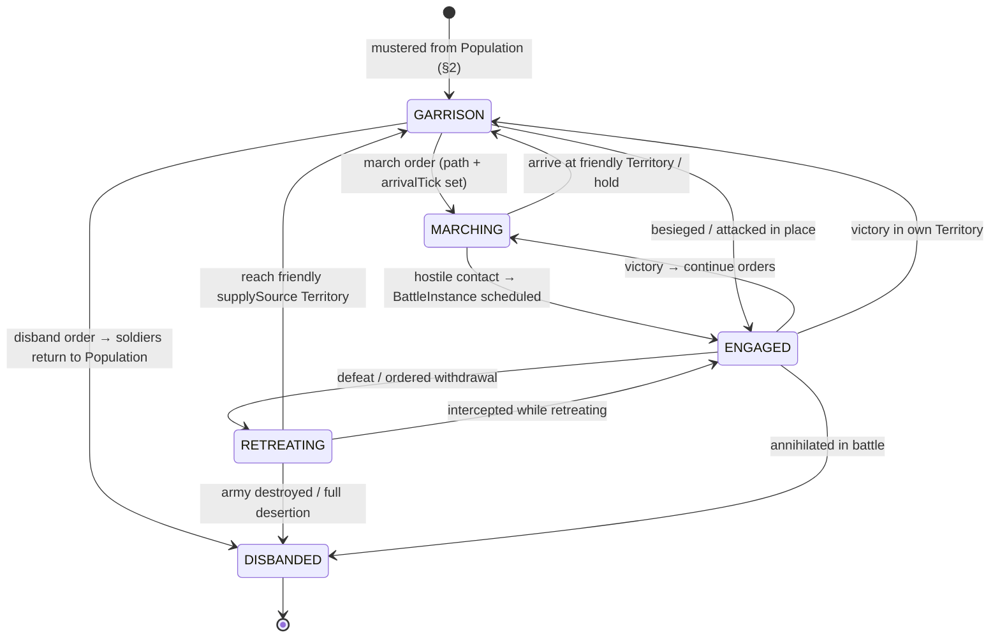

# 03 — Military

> Armies, units, officers, upkeep, and the logistics elements that make **Pillar 2 (travel time)**,
> **Pillar 3 (supply lines)**, and **Pillar 4 (population)** real. All schemas (`Army`, `UnitStack`,
> `SupplyTrain`, enums `ArmyState`, `UnitClass`) and constants (`SUPPLY_MAX_DEFAULT`,
> `SUPPLY_BREAK_PENALTY`, `DESERTION_MORALE_THRESHOLD`, `HERO_IMPACT_MAX`, `TICK_SECONDS`) are canon
> in [`08-data-models.md`](./08-data-models.md) — **never redefine them**. Numeric tuning values
> introduced here (marked ⚙) live in `balance.json` and may be retuned without code changes.

---

## 1. Army composition

An **Army** is a stack of `UnitStack`s, optionally led by a **Hero** (officer), owned by a
**Governor** (`ownerGovernorId`). It occupies exactly one `Hex`, carries its own `supply`
(0..`supplyMax`, default `SUPPLY_MAX_DEFAULT = 100`) and `morale` (0–100), and may have attached
`SupplyTrain`s. See the `Army` / `UnitStack` interfaces in
[`08-data-models.md §4`](./08-data-models.md).

- **No hero attached (`heroId` undefined) ⇒ AI-led.** The army obeys governor orders via the
  Military AI ([`06-ai-architecture.md`](./06-ai-architecture.md)); it gets **no** officer buffs
  (§6) and contributes **zero** HeroImpact in battle.
- Max `UnitStack`s per army: **8** ⚙ (`ARMY_MAX_STACKS`). Stacks of the same `UnitClass` and
  veterancy auto-merge.
- Soldier headcount of an army: `soldiers(army) = Σ stack.count`.

### 1.1 Lifecycle — `ArmyState` state machine



Transition rules:

| Transition | Guard / effect |
|---|---|
| → `MARCHING` | Requires valid `path` + `arrivalTick` (Invariant 8, 08 §5). Movement costs per [`01-world-simulation.md`](./01-world-simulation.md). |
| → `ENGAGED` | Set by the battle scheduler when a `BattleInstance` is created ([`04-battle-system.md`](./04-battle-system.md)). Army cannot move while `ENGAGED`. |
| → `RETREATING` | Morale floor applied: `morale = max(morale − 15⚙, 0)`. Retreating armies move at ×1.25 speed but suffer ×2 supply drain and can be intercepted. |
| → `DISBANDED` | Terminal. Surviving soldiers convert back to `Territory.population` of the disband location at **90%** ⚙ (10% do not return: settled/lost). |

---

## 2. Raising armies from Population (RoTK model)

Soldiers are **never spawned from nothing**. Training an army **converts `Territory.population`
into `UnitStack.count`**, one-for-one, gated by draft capacity and food. Disbanding converts back
(§1.1). This is what makes Population a strategic resource (Pillar 4) and pillaging it a real wound.

### 2.1 Support cap formula

A territory can *sustain* (train + keep supplied from home) at most:

```
draftCap(T)  = floor( T.population × (DRAFT_BASE + DRAFT_PER_MIL × T.development.MILITARY) )
foodCap(T)   = floor( foodSurplusPerDay(T) / SOLDIER_FOOD_PER_DAY )
supportCap(T)= min( draftCap(T), foodCap(T) )

DRAFT_BASE          = 0.05   ⚙  // 5% of population may bear arms untrained society
DRAFT_PER_MIL       = 0.03   ⚙  // per MILITARY development level (0..5)
SOLDIER_FOOD_PER_DAY= 1      ⚙  // Food units per soldier per day (civilians cost 0.2 ⚙)
```

`foodSurplusPerDay` = territory food production minus civilian consumption; production scales with
`AGRICULTURE` development ([`02-economy.md`](./02-economy.md)). **Both tracks matter:** `MILITARY`
raises how many you may draft; `AGRICULTURE` raises how many you can feed.

**Worked example — 10,000 population:**

| Case | MILITARY | AGRICULTURE | draftCap | foodCap | **supportCap** |
|---|---|---|---|---|---|
| Undeveloped village | 0 | 0 (surplus 600/day) | 500 | 600 | **500** |
| Balanced town | 2 | 2 (surplus 1,800/day) | 1,100 | 1,800 | **1,100** |
| War economy | 5 | 4 (surplus 3,500/day) | 2,000 | 3,500 | **2,000** |

Same 10,000 people support **500 vs 2,000 soldiers** purely through development choices.

### 2.2 Training pseudocode

```ts
function trainUnits(t: Territory, unitClass: UnitClass, count: number) {
  assert(currentSoldiersSupportedBy(t) + count <= supportCap(t));
  assert(t.population - count >= POP_FLOOR(t));          // ⚙ can't empty a territory
  assert(t.ctTreasury >= count * TRAIN_COST_CT[unitClass]);
  t.population -= count;                                  // conversion, not creation
  debitLedger(t, count * TRAIN_COST_CT[unitClass], 'train');
  garrison(t).addStack({ unitClass, count, veterancy: 0, hp: 100 });
  // trained units appear after TRAIN_TIME_TICKS[unitClass] ⚙ in the garrison
}
```

Drafting also costs civil morale: `t.morale −= ceil(count / t.population × 100) × 0.5⚙` — heavy
conscription breeds rebellion risk ([`02-economy.md`](./02-economy.md)).

---

## 3. UnitClasses

Canonical enum: `UnitClass = INFANTRY | ARCHER | CAVALRY | SPEAR | SIEGE | MARINE | SHIP`.

| UnitClass | Role | Battle types | classBase ⚙ | Train CT ⚙ /soldier | Upkeep (Food/day, CT/day per 100) ⚙ | Notes |
|---|---|---|---|---|---|---|
| `INFANTRY` | Line holder, cheap mass, garrison filler | FIELD, SIEGE | 10 | 2 | 100 / 1 | Baseline everything |
| `ARCHER` | Ranged attrition, wall defense | FIELD, SIEGE | 9 | 3 | 100 / 1.5 | Best on walls (SIEGE defense ×1.3 ⚙) |
| `CAVALRY` | Shock, pursuit, raiding SupplyTrains | FIELD | 14 | 6 | 150 / 3 | +25% ⚙ march speed when army is pure cavalry |
| `SPEAR` | Anti-cavalry anchor | FIELD, SIEGE | 9 | 2.5 | 100 / 1 | Cheap insurance vs cavalry |
| `SIEGE` | Structure damage (walls/structures `hp`) | SIEGE | 4 | 10 | 120 / 4 | ×6 ⚙ damage vs `StructureState.hp`; halves army march speed |
| `MARINE` | Boarding, amphibious assault | NAVAL, SIEGE (coastal) | 10 | 4 | 110 / 2 | Only class that fights on ship decks *and* beaches |
| `SHIP` | Naval platform, blockade, transport | NAVAL | 16 | 12 | 0 / 6 | `count` = hulls; carries `SHIP_CAPACITY = 200` ⚙ soldiers each |

### 3.1 Counter table (rock–paper–scissors)

Attack multiplier of **row vs column** (applied as `counterMod` in §10; symmetric defense implied):

| atk \ def | INFANTRY | ARCHER | CAVALRY | SPEAR | SIEGE | MARINE | SHIP |
|---|---|---|---|---|---|---|---|
| **INFANTRY** | 1.0 | 1.0 | 0.8 | **1.25** | **1.5** | 1.0 | — |
| **ARCHER** | **1.25** | 1.0 | 0.8 | **1.25** | **1.25** | 1.0 | — |
| **CAVALRY** | 1.0 | **1.5** | 1.0 | **0.6** | **1.5** | 1.0 | — |
| **SPEAR** | 0.8 | 0.8 | **1.5** | 1.0 | 1.25 | 1.0 | — |
| **SIEGE** | 0.5 | 0.5 | 0.4 | 0.5 | 1.0 | 0.5 | 0.8 |
| **MARINE** | 1.0 | 1.0 | 1.0 | 1.0 | 1.25 | 1.0 | **1.25** (boarding) |
| **SHIP** | — | — | — | — | 1.0 | 0.8 | 1.0 |

Loop: **CAVALRY → ARCHER → INFANTRY/SPEAR → (SPEAR →) CAVALRY**. `SIEGE` is a tool, not a fighter.
`—` = cannot engage (land units fight ships only via `MARINE` boarding or coastal `ARCHER`/`SIEGE`
per [`04-battle-system.md`](./04-battle-system.md)).

---

## 4. Veterancy (0–3)

`UnitStack.veterancy` is an integer 0..3 (canon, 08 §4). It is earned, never bought.

| Veterancy | Title | `vetMult` ⚙ | Requirement (battles survived) |
|---|---|---|---|
| 0 | Recruit | 1.00 | — |
| 1 | Regular | 1.08 | 1 |
| 2 | Veteran | 1.16 | 3 |
| 3 | Elite | 1.25 | 7 |

- A stack gains a survival credit when it ends a resolved `BattleInstance` with `count > 0` and
  ≥ 25% ⚙ of its pre-battle count.
- **Reinforcing dilutes:** merging recruits into a veteran stack recomputes veterancy as the
  count-weighted floor (§9.1) — elite armies are precious and expensive to maintain, not stackable.
- **Cap philosophy:** the hard cap of 3 (+25% max) mirrors `HERO_IMPACT_MAX` — experience is a
  *soft* multiplier, never runaway power. A 3-vet army loses to a 1.3× larger recruit army. No
  veterancy above 3 will ever be added; do not extend the enum.

---

## 5. Officers: Masters leading armies on the map

> Canon 2026-07: officers are **Masters** — EF character NFTs the player owns or **rents**
> (README glossary; live roster/KO API in [`09-api-contracts.md`](./09-api-contracts.md) §7).
> `Hero`/`heroId` remain the schema names for now.

A Master attached as `Army.heroId` is the army's **officer**. Map-layer officer effects are
**completely separate from in-battle HeroImpact** (which applies only inside a `BattleInstance` and
is clamped by `HERO_IMPACT_MAX = 0.20`, Invariant 4).

**Master tenure & KO gates (authoritative: EF Masters API):**
- Attach requires the Master to be on the player's active roster (`/masters/active/{wallet}`),
  `alive: true`, and not KO'd (`/masters/ko/{masterId}`).
- **Rental expiry** (`rentalExpires` past) auto-detaches the officer wherever the army is — the army
  becomes AI-led on the spot (conservative doctrine below). Plan campaigns around your lease.
- A Master **KO'd in battle** (reported via `POST /masters/result`) stops officering until `koUntil`
  passes or a limited **revive** is spent (`revivesRemaining`) — losing a general mid-campaign is a
  real strategic cost, exactly as in RoTK.

Officer effects derive from a computed **Leadership score** `L` (0–100) from `Hero.fame` tier,
`titleIds`, and command-type equipment — consistent with the canon rule that Clash Front does not
permanently level heroes.

| Map effect | Formula ⚙ | Max at L=100 |
|---|---|---|
| Morale regeneration | `+ floor(L / 20)` morale/day while resting | +5/day |
| Supply efficiency | `supplyDrain × (1 − 0.15 × L/100)` | −15% consumption |
| March speed | `moveCost × (1 − 0.10 × L/100)` | −10% travel time |
| Desertion resistance | desertion rate ×`(1 − 0.25 × L/100)` (§8) | −25% desertion |

**AI-led armies** (no `heroId`): none of the above, and the Military AI uses conservative doctrine
(retreat earlier, hug supply lines). A hero can attach/detach only while the army is `GARRISON`.
One hero leads at most one army; killing or capturing the officer in battle strips these buffs
immediately (see [`04-battle-system.md`](./04-battle-system.md)).

---

## 6. Upkeep & consumption

Armies consume **Food** (soldiers eat) and **CT** (wages/maintenance) every tick
(`TICK_SECONDS = 60`; daily rates below are divided by 1,440 ticks/day).

```
foodUpkeepPerDay(a) = Σ_stacks count × FOOD_PER_DAY[unitClass] / 100
ctUpkeepPerDay(a)   = Σ_stacks count × CT_PER_DAY[unitClass]   / 100
                      × distanceFactor(a) × empireFactor(owner)         // §11

distanceFactor(a) = 1 + 0.05⚙ × supplyDistanceHexes(a)   // hexes to nearest friendly
                                                          // supplySource Territory (or SupplyTrain relay)
```

Payment order each tick: army draws Food/CT from its supply chain (home `foodStock`/`ctTreasury`
via SupplyTrains). If the chain cannot pay:

| Shortfall | Effect per day unfed/unpaid ⚙ |
|---|---|
| Food | `morale −8`, `hp −5` on all stacks, `supply −10` extra |
| CT | `morale −4` (mutinous pay), no hp loss |
| Supply cut (`supply == 0` or no route) | flat `SUPPLY_BREAK_PENALTY = 0.35` combat power loss (§10) + food shortfall effects |

An army standing in `GARRISON` inside a friendly `supplySource` territory pays **no
distanceFactor** and refills `supply` at +20/day ⚙.

---

## 7. Supply trains

`SupplyTrain` (canon schema, 08 §4) is the mobile logistics element: it **extends supply range**,
**ferries Food/CT** from a `supplySource` territory to an army, and is a first-class **raid
target** (Pillar 3).

| Train profile ⚙ | capacity | Speed (× army march) | Notes |
|---|---|---|---|
| Light (pack) | 2,000 | 1.0 | Keeps pace with the army; small buffer |
| Standard (wagon) | 6,000 | 0.7 | Needs roads/plains preferred |
| Heavy (convoy) | 15,000 | 0.5 | Siege-feeding; huge target |

Mechanics:

- Each attached train adds **+3 hexes** ⚙ to effective supply range (relay), chainable up to 3
  trains ⚙.
- `carrying` depletes as the army draws upkeep; the train cycles back (`state: 'MOVING'`) to reload.
- **Raiding:** any hostile army entering the train's hex may attack it without a full
  `BattleInstance` (skirmish auto-resolve, [`04-battle-system.md`](./04-battle-system.md)).
  A raided train (`state: 'RAIDED'`) loses all `carrying` (looted as CT/Food by the raider) and is
  destroyed or captured. `CAVALRY`-heavy armies are the natural raiders (§3).
- Escorting is a contract type (`ESCORT_SUPPLY`, 08 §4 — Contracts).

Tradeoff: heavy trains feed sieges for days but crawl and telegraph your campaign; light trains
enable fast raids but starve in long sieges.

---

## 8. Desertion & morale in the field

Army `morale` (0–100) moves per tick from events: victory `+10` ⚙, defeat `−20` ⚙, days unfed (§6),
officer effects (§5), deep enemy territory `−1/day` ⚙, resting in friendly garrison `+5/day` ⚙.

**Desertion triggers** — evaluated every tick, applied daily-prorated:

```ts
function desertionRate(a: Army): number {              // fraction of soldiers/day
  if (a.morale >= DESERTION_MORALE_THRESHOLD) return 0; // canon = 25
  const moraleGap = (DESERTION_MORALE_THRESHOLD - a.morale) / DESERTION_MORALE_THRESHOLD;
  let rate = DESERTION_BASE * moraleGap;               // DESERTION_BASE = 0.05 ⚙ (5%/day at morale 0)
  if (a.supply === 0)       rate *= 2.0;               // ⚙ supply cut
  if (unfedDays(a) >= 2)    rate *= 1.5;               // ⚙ hunger
  if (a.state === 'RETREATING') rate *= 1.5;           // ⚙ routing armies bleed
  rate *= 1 - 0.25 * leadership(a) / 100;              // officer resistance (§5)
  return min(rate, 0.20);                              // ⚙ hard cap 20%/day
}
// deserters: 50% ⚙ return to nearest friendly Territory.population, 50% are lost
```

**Recovery:** only by resting — `GARRISON` state in a friendly territory with positive
`foodStock`. There morale regenerates, `hp` heals +5/day ⚙ (drawing Food), and `supply` refills.
There is no CT purchase that restores morale directly (anti-P2W).

---

## 9. Reinforcements, merging, splitting, garrisons

### 9.1 Merge / split

Two armies of the same `ownerGovernorId` on the same hex, both not `ENGAGED`, may **merge**:

```
merged.morale    = countWeightedMean(a.morale, b.morale)
merged.supply    = min(a.supply + b.supply, merged.supplyMax)
same-class stacks: veterancy = floor(countWeightedMean(vetA, vetB))   // dilution, §4
heroId           = chosen by owner (one officer; the other detaches)
```

**Split** allocates whole stacks (or partial counts) to a new `Army`; morale copies, supply divides
pro-rata, the new army is AI-led unless a hero attaches. Merge/split only in `GARRISON` or
`MARCHING`-halted states — never mid-battle.

### 9.2 Reinforcing an ongoing battle

Armies arriving at a hex with a `RUNNING`/`SCHEDULED` `BattleInstance` join their side's
`attackerArmyIds`/`defenderArmyIds` if they arrive before `lobbyClosesAt`; later arrivals wait
adjacent. Travel time deciding whether reinforcements matter **is the game** (Pillar 2).

### 9.3 Garrisons

A garrison is simply an `Army` with `state: 'GARRISON'` referenced by `Territory.garrisonArmyId`.
It defends automatically in a `SIEGE`, gains the territory's `DEFENSE` development and structure
bonuses ([`04-battle-system.md`](./04-battle-system.md)), pays no `distanceFactor` at home, and is
the only state from which training, disbanding, merging, and hero attachment occur.

---

## 10. Army strength — effective combat power

The single formula that feeds `WarScore` ([`04-battle-system.md`](./04-battle-system.md) owns
terrain/structure terms and final resolution; this section owns the army term):

```ts
function stackPower(s: UnitStack, enemyMix: UnitMix): number {
  return s.count
       * CLASS_BASE[s.unitClass]                 // §3 table
       * counterMod(s.unitClass, enemyMix)       // §3.1, mix-weighted
       * VET_MULT[s.veterancy]                   // §4: 1.0 → 1.25
       * (s.hp / 100);
}

function armyStrength(a: Army, enemyMix: UnitMix): number {
  const base    = a.units.map(s => stackPower(s, enemyMix)).reduce(sum);
  const morale  = 0.5 + 0.5 * (a.morale / 100);            // 0.5 .. 1.0
  const supply  = isSupplied(a) ? 1.0 : (1 - SUPPLY_BREAK_PENALTY);  // ×0.65 when cut
  return base * morale * supply;
}

// Battle side power (per 04-battle-system):
sidePower = Σ armyStrength(...) × terrainMod × structureMod   // ≥ 80% of outcome
          × (1 + clamp(heroImpact, 0, HERO_IMPACT_MAX))       // ≤ 20% swing, Invariant 4
```

**Reconciliation with the Hero Impact Cap:** everything in `armyStrength` — headcount raised from
Population (§2), class composition vs the enemy (§3), veterancy earned in campaigns (§4), hp and
morale husbanded by logistics (§6–8), supply kept alive by SupplyTrains (§7) — multiplies together
*before* the hero term, and the hero term is clamped to `1.20×`. A starving, cut-off army
(`×0.65`) at morale 20 (`×0.60`) fights at **39%** power; no hero can close that gap. The map beats
the lobby, by construction.

---

## 11. Anti-snowball & catch-up

| Mechanism | Effect |
|---|---|
| **Empire upkeep factor** ⚙ | `empireFactor = 1 + 0.10 × max(0, totalSoldiers(owner)/50_000 − 1)` — CT upkeep scales superlinearly past 50k soldiers; doom-stacks tax themselves. |
| **Distance factor** (§6) | Power projection gets more expensive per hex; large empires fight far from `supplySource` territories. |
| **Population is finite** | Every soldier is a missing taxpayer/farmer (§2); overdrafting collapses prosperity ([`02-economy.md`](./02-economy.md)). |
| **Veterancy cap + dilution** (§4) | No compounding elite army; losses reset to recruits from Population. |
| **Occupation debt** | Newly occupied territories start at low prosperity/morale and can rebel — conquest outruns consolidation ([`02-economy.md`](./02-economy.md)). |
| **Bounties & mercenaries** | `BOUNTY_HERO` / `MERCENARY_DEFEND` contracts (08 §4) let the world pay to check the leader (Pillar 7). |
| **Supply raiding** | The bigger the army, the fatter its SupplyTrains — asymmetric counterplay for small raiders (§7, Pillar 9). |

> ❓ OPEN: whether `empireFactor` counts mercenary/vassal troops toward `totalSoldiers` — Diplomacy
> AI decision, resolve with [`06-ai-architecture.md`](./06-ai-architecture.md).

---

## Cross-references

- [`README.md`](./README.md) — glossary, Macro Pillars, Hero Impact Cap statement.
- [`08-data-models.md`](./08-data-models.md) — canonical `Army`, `UnitStack`, `SupplyTrain`
  schemas; `ArmyState`, `UnitClass` enums; all constants used here; invariants 4, 5, 8.
- [`01-world-simulation.md`](./01-world-simulation.md) — hex movement, moveCost, travel times,
  seasons affecting supply, supply-range computation.
- [`02-economy.md`](./02-economy.md) — Food production, Population growth, prosperity, drafting's
  civil-morale/rebellion consequences, CT treasury.
- [`04-battle-system.md`](./04-battle-system.md) — how `armyStrength` enters `WarScore`; terrain
  and structure modifiers; skirmish auto-resolve for SupplyTrain raids; officer capture.
- [`05-pve-integration.md`](./05-pve-integration.md) — wild-zone threats to marching armies.
- [`06-ai-architecture.md`](./06-ai-architecture.md) — Military AI doctrine for AI-led armies and
  NPC Kingdom force generation.
- [`09-api-contracts.md`](./09-api-contracts.md) — train/march/merge/split/disband command
  endpoints and army state events.
