# 04 — Battle System

> **Scope:** how battles are **spawned, scheduled, allocated, resolved**, and how outcomes write back
> to the map. Clash Front owns the `BattleInstance` lifecycle and the authoritative `WarScore`.
> **EF MOBA owns moment-to-moment combat** (heroes, abilities, the `BATTLE_TICK_MS = 100` server tick)
> and is treated here as an integrated match service. This doc never specifies combat mechanics.
>
> Canonical types used throughout — do not redefine, see [`08-data-models.md`](./08-data-models.md):
> `BattleInstance`, `BattleType`, `ResolutionMode`, `BattleState`, `BattleParticipant`, `WarScore`,
> `BattleResult`, `PostVictoryAction`, and constants `HERO_IMPACT_MAX`, `TICK_SECONDS`,
> `SUPPLY_BREAK_PENALTY`, `BATTLE_TICK_MS`.

---

## 1. Battle triggering (world-tick coupled)

Battles are created **only by the world tick engine** ([`07-backend-architecture.md`](./07-backend-architecture.md)),
never directly by client requests. Each tick (`TICK_SECONDS = 60`), after movement resolution, the
engagement pass scans hexes for hostile contact. "Hostile" means the owning governors' `DiplomacyStance`
is `WAR` (or `HOSTILE` + explicit attack order — see [`06-ai-architecture.md`](./06-ai-architecture.md) for NPC decisions).

| `BattleType` | Trigger condition (evaluated per tick) | `hexId` | `defenderTerritoryId` |
|---|---|---|---|
| `FIELD` | Two hostile armies occupy the same **land** hex, or one enters a hex an enemy occupies, and neither is inside a fortified friendly territory | contact hex | — |
| `SIEGE` | A hostile army enters a hex of a territory with `zoneType ∈ {TOWN, FORTRESS, HARBOR, CAPITAL}` **or** any territory with a garrison / walls structure, and issues/holds an attack order | territory's anchor hex | **required** (invariant 9) |
| `NAVAL` | Two hostile fleets (armies whose stacks are majority `SHIP`) occupy the same **sea** hex; or a fleet enters a hex inside an active blockade ring of a hostile `HARBOR` | contact hex | harbor's territory if blockade assault |

Trigger pseudocode (engagement pass):

```ts
for (const hex of hexesWithMultipleGovernors(tick)) {
  const pairs = hostilePairs(hex);                    // stance == WAR, or HOSTILE + attackOrder
  for (const { attackers, defenders } of pairs) {
    if (alreadyEngaged(attackers, defenders)) { mergeAsReinforcement(hex); continue; } // §8 FIELD
    const type = classify(hex, defenders);            // NAVAL if sea hex; SIEGE if fortified territory; else FIELD
    createBattleInstance({
      type, hexId: hex.id,
      attackerArmyIds, defenderArmyIds,
      defenderTerritoryId: type === 'SIEGE' ? territoryOf(hex).id : undefined,
      state: 'SCHEDULED',
      scheduledStartTick: tick + startDelayTicks(type),   // see §2 timings
    });
    setArmyStates('ENGAGED'); if (type === 'SIEGE') territory.underSiegeBattleId = battle.id;
  }
}
```

An `ENGAGED` army cannot move (except via retreat, §9). A `SIEGE` territory freezes construction and
market orders while `underSiegeBattleId` is set ([`02-economy.md`](./02-economy.md)).

---

## 2. Lifecycle state machine

```mermaid
stateDiagram-v2
    [*] --> SCHEDULED : engagement pass creates BattleInstance
    SCHEDULED --> LOBBY : scheduledStartTick reached\n(lobby opens, lobbyClosesAt set,\nplayers notified, server pre-allocated)
    SCHEDULED --> CANCELLED : all of one side retreats/disbands\nbefore lobby opens
    LOBBY --> RUNNING : lobbyClosesAt reached\n(ResolutionMode locked, §3)
    LOBBY --> CANCELLED : one side fully retreats\nor diplomacy TRUCE signed
    RUNNING --> RESOLVED : AUTO: same tick\nACCELERATED: ≤ 1 tick\nLIVE: EF MOBA match end / timeout
    RUNNING --> CANCELLED : catastrophic infra failure only\n(server lost AND no checkpoint)
    RESOLVED --> [*] : BattleResult applied to map (§7, §8)
    CANCELLED --> [*] : no map mutation; armies released (§9)
```



Timings (tunable in `balance.json`; ❓ OPEN — final numbers are Battle+Backend owned):

| Phase | FIELD | SIEGE | NAVAL | Notes |
|---|---|---|---|---|
| `SCHEDULED → LOBBY` delay | 1 tick | 5 ticks | 2 ticks | siege gives defenders warning — travel time matters |
| `lobbyClosesAt` (lobby length) | 120 s | 300 s | 180 s | absolute epoch ms on the instance |
| Reinforce window (LIVE, §4) | first 40% of match | first 50% | first 40% | after this, drop-in closes |
| LIVE hard timeout | 25 min | 35 min | 25 min | on timeout, sim finishes from last EF MOBA checkpoint |

`LOBBY` is when the drop-in decision happens: eligible players are pushed a battle notification
(WebSocket, [`09-api-contracts.md`](./09-api-contracts.md)) and the battle allocator reserves EF MOBA
server capacity **speculatively** — reservation is released if the mode resolves to `AUTO`.

---

## 3. ResolutionMode decision

Locked once, at `lobbyClosesAt`:

```ts
function decideMode(b: BattleInstance): ResolutionMode {
  const humans = b.participants.filter(p => p.role === 'HERO').length; // joined during LOBBY
  if (humans === 0) {
    // No humans opted in. High-stakes battles still get a deterministic fast sim so the
    // outcome is replayable/auditable; trivial ones resolve instantly.
    return stakes(b) >= STAKES_ACCEL_THRESHOLD ? 'ACCELERATED' : 'AUTO';
  }
  if (!allocator.confirmCapacity(b)) return 'ACCELERATED';   // no server ⇒ never block the world
  return 'LIVE';
}
// stakes(b): CAPITAL/FORTRESS siege > HARBOR > TOWN > field/naval; scaled by total ArmyStrength.
```

- **`AUTO`** — statistical resolution of the §5 formula in the same world tick. `HeroImpact` term for
  AI-led heroes comes from officer equipment/traits ([`03-military.md`](./03-military.md)), still clamped.
- **`ACCELERATED`** — deterministic fast-forward simulation (seeded by `World.seed + battle.id`),
  finishes within one tick, emits a watchable replay. Used when no humans joined in time or capacity
  is unavailable. Same formula, same clamp — mode never changes expected outcome, only fidelity.
- **`LIVE`** — handed to EF MOBA: allocator binds `efMobaMatchId`, seeds the match from overworld
  state (army composition, terrain, structures), players drop in as heroes. Clash Front is a
  spectator of *combat* but stays authoritative over *outcome* (§6).

**North-star guard:** expected `WarScore` is mode-invariant. `LIVE` only moves the outcome within the
`HERO_IMPACT_MAX` band; a battle you'd lose 80/20 on paper cannot be won purely by playing well.

### 3a. COMMAND vs AUTO — the march-time choice (owner, 2026-07-04) — SCALING KEYSTONE

LIVE (30 Hz, joinable, steerable) is a SCARCE, OPT-IN resource; AUTO (accelerated resolve,
watch-only after) is the DEFAULT. You cannot run a live server for every border clash in a
293k-parcel world — so the player DECLARES intent at MARCH time, and the system honors it only
within a bounded live-match budget.

- **Two march orders:** `MARCH` (auto — resolve it for me; watch the replay after) and
  `MARCH & COMMAND` (I want to play/steer this battle live). Default = MARCH (auto).
- **Command SLOTS (per-player attention cap):** a player may have only ⚙ N concurrent COMMAND
  battles (MVP ⚙ small, e.g. 1–2). Beyond that, further battles auto-resolve — you command the
  fights you actually care about.
- **Live-match POOL + QUEUE (server capacity backpressure):** the global count of live 30 Hz
  matches is capped ⚙. A COMMAND battle whose start would exceed the pool is QUEUED (created,
  live-start deferred) until a slot frees; if it waits past ⚙ `commandQueueTimeout`, it falls
  back to AUTO. So COMMAND is best-effort: guaranteed a fight, live when capacity allows.
- **Mode selection (SUPERSEDES §3 `decideMode` "≥1 human ⇒ LIVE"):**
  `LIVE` iff ANY participant elected COMMAND **and** holds a free command slot **and** the live
  pool has room (else queue, else AUTO). No command intent anywhere ⇒ ACCELERATED (or AUTO for
  trivial stakes). Human-never-in-range battles always auto-resolve. Applies to **PvP too** — a
  player-vs-player battle auto-resolves unless a participant spent a command slot on it.
- **Watch-only after AUTO:** an auto/accelerated battle emits a replay you can review; you
  cannot steer it or take the field (that's what COMMAND buys).
- **Future ⚙ COMMAND FEE:** dedicating a general to live command may cost CT ("dedicated-command
  compensation") — a sink + a soft rate-limiter beyond hard slots. Phased with the CT economy.
- **Why this scales:** only battles a player actively commands consume 30 Hz capacity; the
  entire rest of the war runs cheap accelerated resolution. Server expansion = more live-pool
  slots. This is the mechanism that makes a persistent world-scale battlefield tractable.

Relationship to the existing drop-in model (§4): COMMAND-intent-at-march replaces the open
LOBBY as the primary "I want to play this" signal, bounded by slots/pool; the LOBBY/reinforce
join paths still apply on top of a battle that has already gone LIVE.

### 3b-LIVE. Live-match duration, join window & army pool (owner, 2026-07-04)

The interface CF sends and the MOBA match server honors for a LIVE (COMMAND) battle:
- **Duration ⚙ ≈ 10–15 min** — a normal MOBA match length. The match server keeps it open at
  30 Hz for the whole window; it must NOT resolve instantly (an instant match is unjoinable —
  the root of "the battle ends too quickly to join").
- **Join window = the whole duration.** A player may join ANY time while it runs (mid-game
  seating via a freshly-minted ticket). Optional **~2 min pre-start countdown** lets a player
  join from the very start as a fresh match; joining later drops them into the running battle.
- **Line-soldier pool = the army count CF sends.** The allocate context's `units:[{cls,count}]`
  per side IS the finite wave stock (entry variable, e.g. 200/side, equal sides for MVP). Once
  depleted, NO more line soldiers spawn except units the player spawns directly in-game (canon
  finite-wave R4/R5). The MOBA may cap the concurrent line count; the TOTAL is CF's number.
- **You command your Master; enemy Masters are AI.** Ticket + start payload carry the player's
  Master (`youUid`/`youHn`, real `masterId`/`slug` from CF); auto-seat as that Master, enemy
  Masters bot-driven (ONE-HERO per user, §3a / decision 11).
CF side of all four is DONE (duration/window need no CF change — CF holds the ⚡ doorway open with
no tick timeout for LIVE battles; the army count + Master identity are already in the allocate
context). The remaining work is the match server's (keep-open, finite-pool, late-seat) + the
client's (ticket-bypass login, auto-seat). Command-view↔MOBA-map alignment: the match server must
send the real loaded map layout in `battle_hello` (`briefs/BATTLEFIELD-SCHEMA.md`, §1a).

**IMPLEMENTED (2026-07-04, behind the engine-battles flag).** `POST /api/march` takes
`command?: boolean` (default false = AUTO) → persisted as `army.commandIntent`, consumed at the
collision tick. Caps live in `balance.json` `battle` (⚙ `commandSlotsPerPlayer` 2,
`liveMatchPoolMax` 8, `commandQueueTimeoutTicks` 20). The sim (`createEngineBattle` /
`promoteQueuedEngineBattles`, packages/sim-engine) owns the LIVE / QUEUED / ACCELERATED decision
deterministically; `EngineBattleState` gains a `QUEUED` status + `commandGovernorIds` +
`queuedTick`. Kill switch = `CF_LIVE_BATTLES=0` → `tickOptions.liveBattles`. Client: the march
popover offers **⚔ March** (auto) and gold **⚔ March & Command** (live) with a `Command used/max`
hint; an at-capacity march toasts the auto-resolve downgrade; only LIVE engine battles open the
command viewer / ⚡ doorway. Wire details: `docs/briefs/ALLOCATE-CALLBACK-SCHEMA.md` §3b MODE
SELECTION. The COMMAND FEE remains a future ⚙ hook (not built).

---

## 4. Drop-in / join model

The LoL-with-overworld magic: any qualifying battle offers three player choices during `LOBBY`.

| Choice | When | Effect |
|---|---|---|
| **Auto-Resolve** | LOBBY (default on timeout) | Player abstains; their armies fight AI-led. Counts as zero human participants for mode decision. |
| **Join** | LOBBY, before `lobbyClosesAt` | Take hero control from match start. Appends a `BattleParticipant { side, joinedTick, role:'HERO' }`. |
| **Reinforce** | RUNNING (LIVE only), within the reinforce window (§2) | Drop into an in-progress match, spawning as one of the side's **NPC officers** — the player possesses an existing AI-led hero slot rather than adding power. |

**Eligibility & side assignment** (evaluated at join request):

```ts
canJoin(player, battle, side) ⇔
     ownsArmyIn(battle, side, player)                                   // your army is fighting
  || isGovernorParty(battle, side, player)                              // governor / guild / alliance of a combatant
  || hasContract(player, side, battle)                                  // MERCENARY_ATTACK / MERCENARY_DEFEND (08 §4)
  || isDefenderLandlord(battle, player) && side === 'DEFENDER';         // landlord may defend their land
// Side is derived from the qualifying relationship — never free choice. Conflicts (qualifies for
// both sides) resolve to the FIRST lock-in; the other side is then forbidden for this battle.
```

- A hero can be in **at most one** `RUNNING` battle (hero location is a map fact — travel time matters:
  the hero must be leading or garrisoned with a participating army, or within `HERO_JOIN_RANGE_HEX`
  of the battle hex; ❓ OPEN: exact range, Sim-owned).
- **Possession model:** joining never adds units. The player takes control of a hero/officer slot the
  side already fields. Reinforcing mid-match replaces the AI controller of a surviving NPC officer.
- Per-side human hero slots are capped at `MAX_HEROES_PER_SIDE = 5` (❓ OPEN: tuning); overflow
  requests go to a spectate/queue list and promote on disconnect.
- Every accepted join/reinforce is recorded as a `BattleParticipant` on the instance — this list is
  the audit trail for HeroImpact attribution, fame, and anti-abuse (§10).

---

## 5. WarScore computation (authoritative)

`WarScore` is the single aggregate that decides every battle, in every mode. It instantiates the
canonical outcome function `f(ArmyStrength, HeroImpact, Terrain, Supply, Morale)` with the
**ArmyStrength ≥ 80% / HeroImpact ≤ 20%** split (README, Pillar 5).

```ts
function warScore(side: Side, b: BattleInstance): number {
  const army    = armyStrength(side);            // 03-military: Σ count × classPower × vetMult × (hp/100), counters applied
  const supplyF = supplyCut(side) ? (1 - SUPPLY_BREAK_PENALTY)            // 0.65 hard penalty
                                  : lerp(0.85, 1.00, avgSupplyPct(side)); // partial depletion bites
  const moraleF = 0.70 + 0.006 * avgMorale(side);                         // 0.70 .. 1.30
  const terrF   = terrainModifier(b.hexId, side, b.type);                 // 0.90 .. 1.15 (table below)
  const structF = (b.type === 'SIEGE' && side === 'DEFENDER')
                ? min(1.5, 1 + 0.05 * Σ(defStructure.level × structure.hp / structure.maxHp))
                : 1.0;
  const hero    = clamp(heroImpactRaw(side, b), 0, HERO_IMPACT_MAX);      // invariant 4 — ALWAYS clamped
  return army * supplyF * moraleF * terrF * structF * (1 + hero);
}
// Outcome: R = warScore(ATTACKER) / warScore(DEFENDER)
//   R ≥ 1.05 → ATTACKER wins;  R ≤ 0.95 → DEFENDER wins;  else DRAW (§9)
// breakdown{} on the WarScore record stores each factor: 'army','supply','morale','terrain','hero','structures'.
```

`heroImpactRaw`: in `AUTO`/`ACCELERATED`, computed from officer equipment/traits; in `LIVE`, mapped
from the EF MOBA performance report (§6). It can never exceed `HERO_IMPACT_MAX = 0.20`, regardless
of how many heroes a side stacks — the cap is **per side**, not per hero.

Terrain modifier defaults (❓ OPEN: final table is Sim-owned, `balance.json`):

| `HexTerrain` | Attacker | Defender |
|---|---|---|
| PLAINS / ROAD | 1.00 | 1.00 |
| FOREST | 0.95 | 1.05 |
| HILLS | 0.90 | 1.10 |
| RIVER (crossing) | 0.90 | 1.10 |
| MOUNTAIN | 0.90 | 1.15 |
| COAST/OCEAN (NAVAL) | 1.00 | 1.05 near friendly HARBOR |

### Worked example (a) — stronger army, cut supply, **loses**

Attacker: army 12,000, **supply line cut** (raided supply train), morale 60. Defender: army 9,000,
supplied, morale 80, on HILLS. No heroes.

```
Attacker = 12000 × 0.65 × (0.70 + 0.36) × 1.00 = 12000 × 0.65 × 1.06        =  8,268
Defender =  9000 × 1.00 × (0.70 + 0.48) × 1.10 =  9000 × 1.18 × 1.10        = 10,692
R = 0.77 → DEFENDER wins decisively.
```

A 33% larger army loses because logistics were ignored. Pillar 3 in action.

### Worked example (b) — whale hero cannot flip a lopsided battle

Attacker: army 5,000, best-in-world hero performance ⇒ hero term saturates at 0.20. Defender: army
8,000, no human hero (AI officer term 0.05). Both supplied (supplyF 1.0), morale 75, PLAINS.

```
Attacker = 5000 × 1.0 × 1.15 × 1.00 × (1 + 0.20) = 6,900
Defender = 8000 × 1.0 × 1.15 × 1.00 × (1 + 0.05) = 9,660
R = 0.71 → DEFENDER wins by a wide margin.
```

A perfect MOBA performance moves the needle at most 20%; it cannot beat a 60% army deficit. This is
invariant 4 and the anti-pay-to-win firewall.

---

## 6. LIVE result feedback (EF MOBA → Clash Front)

EF MOBA is authoritative **during** the match; Clash Front is authoritative for the **map consequence**.
On match end, EF MOBA posts a signed result to the battle service (full schema in
[`09-api-contracts.md`](./09-api-contracts.md); shape here is contractual at the field-name level):

```ts
interface EfMobaMatchReport {                 // 09-api-contracts owns the wire schema
  efMobaMatchId: string; battleId: string;
  outcome: 'ATTACKER' | 'DEFENDER' | 'TIMEOUT';
  sidePerformance: { ATTACKER: number; DEFENDER: number };   // normalized 0..1 per side
  perHero: Array<{ heroId: string; playerId: string; performance: number;  // 0..1
                   disconnectedAtPct?: number }>;            // % of match completed before DC
  durationMs: number; checkpoint?: SimCheckpoint;            // for timeout/crash recovery
  signature: string;                                          // service-to-service auth
}
```

Mapping into `WarScore`:

```ts
heroImpactRaw(side) = HERO_IMPACT_MAX × sidePerformance[side]
                    × participationFactor(side);   // see degradation rules below
// then §5 runs unchanged → winner → BattleResult { winner, casualties, resolvedTick, … }
```

The MOBA `outcome` **biases** but does not dictate: it feeds `sidePerformance`, and the §5 formula
(army, supply, morale, terrain, structures) still dominates. Winning the match while outnumbered 3:1
yields a heroic, famous defeat — casualties reduced, fame gained, map still lost.

**Degradation rules:**

| Case | Handling |
|---|---|
| Player disconnects | AI resumes their officer slot; that hero's `performance` is frozen at `disconnectedAtPct`-weighted value. Repeated DCs feed the dodge penalty (§10). |
| No-show (joined lobby, never connected) | Slot reverts to AI at match start; `participationFactor` treats them as absent; dodge strike recorded. |
| Partial participation (reinforced late / left early) | Hero contribution weighted by fraction of match present: `participationFactor(side) = Σ presentPct_i × w_i / Σ w_i`. |
| All humans on a side gone mid-match | Match continues AI-driven to completion; still reported as LIVE. |
| Server crash, checkpoint exists | ACCELERATED sim finishes from `checkpoint`; result marked `resolutionMode: 'ACCELERATED'`. |
| Server crash, no checkpoint | `RUNNING → CANCELLED` (§9). The only path to CANCELLED from RUNNING. |

---

## 7. Battle types — overworld reads & writes

Combat mechanics are EF MOBA's; this table defines only what each type **reads from** and **writes to** the map.

### FIELD — open engagement
- **Reads:** both armies (`UnitStack`s, supply, morale), hex terrain, weather/season ([`01-world-simulation.md`](./01-world-simulation.md)).
- **Retreat:** either side may order retreat during LOBBY or RUNNING; retreating army enters
  `ArmyState.RETREATING`, moves 1 hex toward nearest friendly supply source, suffers pursuit
  casualties `RETREAT_CASUALTY_PCT` (❓ OPEN) and −15 morale. If **all** of one side retreats before
  RUNNING, the battle is `CANCELLED`; mid-RUNNING retreat concedes (loser, reduced casualties).
- **Writes:** casualties, morale deltas, veterancy, positions (loser pushed off hex).

### SIEGE — Clash-of-Clans-style base assault, macro edition
- **Reads:** `defenderTerritoryId` — `StructureState[]` (walls/towers HP & levels), `development.DEFENSE`,
  `garrisonArmyId`, territory morale & foodStock; attacker siege units (`UnitClass.SIEGE`).
- **Defender garrison advantage:** `structF` (§5) plus terrain; a leveled FORTRESS is meant to require
  siege equipment or starvation, not a bigger blob.
- **Multi-wave:** one siege `BattleInstance` may resolve as up to `SIEGE_MAX_WAVES = 3` assault waves
  (each an EF MOBA match or sim pass); structure HP damage **persists between waves** and between
  sieges — walls stay broken until repaired with CT ([`02-economy.md`](./02-economy.md)).
- **Attrition path:** an attacker may camp instead of assaulting; the besieged territory's foodStock
  drains each tick, and at `foodStock = 0` garrison morale decays toward surrender (auto-resolve loss).
- **Writes:** structure `hp` damage, garrison casualties, `underSiegeBattleId` cleared, and on
  attacker victory the `PostVictoryAction` flow (§8) — the only battle type that transfers territory.

### NAVAL — fleets, harbors, blockades
- **Reads:** fleet stacks (`SHIP`, embarked `MARINE`/land units as cargo), sea hex, harbor structures
  when assaulting a blockade ring.
- **Blockade:** a fleet adjacent to a hostile `HARBOR` may declare blockade (no battle yet): the
  harbor's sea routes close — trade and supply-by-sea stop ([`01-world-simulation.md`](./01-world-simulation.md)).
  Breaking a blockade is a NAVAL trigger.
- **Writes:** ship losses (embarked land units sink with their transports — dominant naval risk),
  blockade established/broken, harbor structure damage on blockade assaults. Taking the harbor
  *territory* still requires a SIEGE from its land or port hex.

---

## 7b. Battlefield generation & estate sieges (canon)

> Locked with the product owner (2026-07). Supersedes any earlier "MOBA lanes" framing.

**The battlefield is not a MOBA map.** The battle engine's square map becomes a **battlefield where
armies collide against natural terrain** — no lanes, towers, or creep conventions. Hero drop-in remains.

**Post-battle review (owner 2026-07-04; implemented).** Battles now AUTO-resolve by default (§3a) and
can end fast — "the battle ends too quickly to view." The server therefore keeps a bounded, fog-filtered
**recently-resolved ring** (⚙ `review.ringCap`, newest-first; older battles age out — *only recently-
completed battles are reviewable*, by owner rule). Each record is compact: sides + labels, winner/reason,
casualties/survivors counts, duration, `wasLive`, and a **compact synthesized strength-progression
timeline** (⚙ `review.timelineKeyframes` — an honest reconstruction from start troop counts → known final
casualties with a seeded rhythm; *not* stored 30 Hz frames). It is exposed per-viewer on `/api/state` +
the WS tick as `recentBattles[]` (reusing the live-battle intel gate: you see a fight only if you fought
in it or held ACCURATE intel on its parcel). The client "🎬 Recent battles" control (War-report header;
resolved feed rows are clickable) opens a **result/replay panel** reusing the battle overlay: a RESULT
CARD (winner, reason, casualties/survivors, duration) + a scrubbable strength chart; "▶ Review all"
auto-advances through the ring with a per-battle timer (⚙ `review.reviewTimerSec`), plus prev/next, a
jump dropdown, and manual scrub. Accelerated battles show the honest reconstruction (never a fake live
replay); LIVE/command battles keep their real telemetry. Currently-live battles are NOT in this list —
review is strictly post-resolution (they are watchable live via the existing command channel).
*Sealed-reveal follow-up (⚙ `review.revealDurationTicks`, designed-not-yet-wired):* an AUTO outcome is
computed at collision but may be held SEALED until `startTick + revealDurationTicks` so a fight cannot be
previewed before normal battle time — the same `recentBattles` record + timeline shape already serve it.

**Command-view map & interim stand-ins (owner 2026-07-04; implemented).** The command-mode top-down view
(`apps/server/public/js/battle.js`) is a fully **data-driven renderer of the Battlefield JSON**
(`docs/briefs/BATTLEFIELD-SCHEMA.md`): it draws the bounds polygon, biome-tinted terrain + water
footprints + forest/rock obstacles, lane corridors, structure anchors (CORE / TOWER / GATE / WALL coloured
by side), spawn zones, resource nodes and build-spots, with the LIVE unit snapshot layered on top. Until
the map generator (`briefs/MAP-GENERATOR.md`) ships per-parcel designs, every `battle_hello` carries an
**interim stand-in map from `data/moba-maps/*.json`** — a standard symmetric MOBA layout
(`legacy-3lane.json` for estates/default, `legacy-1lane.json` for single parcels), each a valid Battlefield
JSON passing all five playability invariants and tagged `_placeholder`. Precedence: a REAL exported map
sent by the match server/bridge for a given match wins; otherwise the stand-in (wired in both
`game.ts battleStatic` for sim battles and `bridge.ts battleStatic` for engine/bridge/exhibition battles).
When the generator or the MOBA team's real export lands it drops into the same schema and the renderer
consumes it unchanged, zero renderer edits (`ALLOCATE-CALLBACK-SCHEMA.md` §1a).

**Scale laws (product owner, 2026-07-02):**
- **The overworld game map = the source SVG, verbatim** — the extracted hexagon-city geometry
  (`data/hexagon-city-source/`) IS the world map: exact parcel shapes, positions, proportions.
  Unit scaling (world-units per SVG-unit) is an engineering choice; the geometry is not.
- **1 L3 parcel = 1 MOBA-map-sized battlefield** (the battle engine's existing 240×240-unit
  arena). **Scale LOCKED 2026-07-02: 1 engine unit = 1 meter** ⇒ a SINGLE parcel ≈ 240×240 m
  ≈ **14.2 acres**; heroes are human-sized, armies and castles fit at real proportions. Size
  ladder (median polygon area vs SINGLE): SMALL 27.7×, MEDIUM 116.7×, LARGE 201.5×, GIANT 302.5×,
  EPIC 480.3× (≈6,800 acres ⇒ ~480 battle components). Whole world ≈ 29,900 km². The battlefield **bounds polygon = the parcel's actual shape**, normalized to
  arena scale — you fight on the outline of the land being taken. (Battle-engine plan item A1's
  bounds-polygon model covers this; "hex" boundaries are a special case, not a requirement.)

  > **⚠ Coordinate-frame reconciliation (2026-07-04, authoritative — OP 48 client geometry).**
  > The battle-engine's REAL arena frame is a **FIXED ±161 half-edge ⇒ `sizeM = 322` in
  > dimensionless WORLD-UNITS** (the client's `clampMap ±115 · MAPK 1.4`), center-origin, +z
  > north, blue/ATTACKER = SW, red/DEFENDER = NE, spawns ±131.6, cores ±114.8. Consumed AS-IS
  > post-MAPK — never re-scaled (no ×MAPK anywhere). This SUPERSEDES the "240×240-unit /
  > 1 engine unit = 1 m" framing above **for the battlefield coordinate space only**: the
  > battlefield is world-units at **~0.74 m/unit** (declared mapping: the ±161 frame ≡ 1 parcel ≡
  > ~14 acres = 56,656 m² ⇒ edge ≈ 238 m, over 322 units). The overworld/sim's own "1 unit = 1 m"
  > is a SEPARATE space and still holds. **The arena is FIXED for every battle** — singles and
  > estates alike — so estates do NOT get a bigger arena; per canon decision 4 an estate is a
  > SERIES of standard ±161 component battles, and parcel size scales army/structure COUNT and
  > component COUNT, not arena size. The size-ladder acreage figures above (SINGLE ≈ 14.2 acres,
  > EPIC ≈ 6,800 acres) remain the overworld LAND-AREA estimates and drive component counts; they
  > are not arena dimensions and are to be refreshed later against the real frame. Source of truth
  > = the MOBA BattleEngine's `legacy.json` (matches the client 1:1); the CF stand-ins
  > (`data/moba-maps/legacy-{1,3}lane.json`) are the interim ±161 fill. Frame + schema:
  > `docs/briefs/BATTLEFIELD-SCHEMA.md`, `ALLOCATE-CALLBACK-SCHEMA.md` §1.

**Battle definition (owner, 2026-07-02 v0.2): every battle is a FULL MOBA match** — a real
server-run game, 20–40 minutes, with the armies (PentaPet units + officers) fighting on both
sides. AI-vs-AI battles run the SAME simulation with **accelerated ticks** (fast-forward, not a
different resolver). The overworld's instant WarScore resolution is an acknowledged placeholder
until battle-engine M1+; LIVE pacing then follows match reality (≈20–40 min occupying the parcel).

**Battle anatomy (owner, 2026-07-02, FINAL): the ATTACKER is the WAVES — structures belong to
the LAND HOLDER.**

- **The attacker spawns waves.** Invading ANY land, you arrive with no fortifications — at most
  a minimal **command center camp** (spawn anchor; gold/wood tier ⚙ sets its durability/spawn
  quality, never towers). On WILD maps there is **no attacker CC at all** — StarCraft-campaign
  style, your waves enter from the map edge. Your army stock IS your wave budget: waves and
  waves of spawns push the lane until you **run out** or you win. Your Masters revive per normal
  MOBA respawn rules (limited "runs").
- **Guiding principle (owner): do NOT overcomplicate — build with what the engine already has**
  (waves, towers, cores, respawns, build pads), arranged so each map "makes sense" for who holds
  the ground — like StarCraft campaign missions, where some maps simply don't give you a base.
- **Attacker lose conditions (two):** (1) you run out of runs — army waves + Master revives
  exhausted; (2) your CC camp is destroyed.
- **Structures belong to whoever HOLDS the land:**

| Ground | Defender has | Lanes | Attacker win condition |
|---|---|---|---|
| **WILD** | towers + mobs on the map, NO CC | 1 | defeat all mobs OR destroy their towers |
| **Player parcel** | CC + towers ("normal map") + **hired troops placed on the map**; the defender EDITS their defensive layout (buy/upgrade/place towers) within **LIMITED BUILDING SPOTS** (as in the current MOBA's build pads); only estates get more | 1 | destroy the defender's CC |
| **Estate** | extra build spots: **walls + functional city buildings** (marketplace/crafting etc. — pillageable), multiple **defense rings** (1–3 lines, castle-like; StarCraft-base feel) | **3**, bigger map | fight through the rings to the capital/CC |

- **Estate fallback for browser weight**: if multi-ring single maps are too heavy, break the
  estate into **separate zones fought through sequentially** to reach the capital — i.e. the
  existing per-component campaign model (§7b estates).
- **Defense editing is the defender's game**: spend CT/materials on towers, upgrades, hired
  troop placements — capped by build spots, so estates are structurally (not just numerically)
  stronger.
- **The battlefield IS the parcel's own saved map** (§7b design layer) — every battle map unique.
- Non-decisive end (clock/timeout, no win condition met): attacker chooses — re-assault,
  reinforce, or retreat (origin or nearby empty land, §7c).
- **Decisive loss = your base is destroyed.** Defender's base down ⇒ the defender ENTIRELY
  loses — the ground is taken (PostVictoryAction). Attacker's CC down ⇒ the invasion is repelled.
- **Non-decisive end** (food clock / match timeout, no base killed): the battle finishes and the
  ATTACKER chooses — **assault again** (a new wave; requires provisions, §7c), **hold for
  reinforcements** (stay engaged, more armies merge in), **or retreat** — back the way they came
  or to nearby empty land (the §7c retreat resolution). Sieges are thus naturally multi-wave
  campaigns of full MOBA matches.
- **The battle resolves ON the game map** — a real simulation of these forces, never a stat
  formula.
- **TWO CONTROL SURFACES, ONE BATTLE (owner, 2026-07-03):** every battle exposes two modes over
  the SAME authoritative match:
  1. **COMMAND MODE** — the general's top-down overlay (the overworld's battle viewer): watch
     live, issue high-level orders — move your Master, focus targets, set the wave rally point.
     One click from the overworld map; light enough to open for any battle you can see.
  2. **HERO MODE** — the full 3D MOBA client on the same match: embody your Master (or your
     Hero — Irene/Kai/Leah) at hero level with full MOBA combat. The 20–40 min experience.
  **Seamless interpolation — with the ONE-HERO rule (owner, 2026-07-03, clarified same day):**
  - **ONE HERO PER USER — not per map.** A battle map hosts MANY embodied heroes: 2v2, 3v3 and
    beyond, with ALLIED users joining either side. Each user commands exactly ONE hero at a time.
  - **Multiple Masters may fight on the same map** (several of your officers/armies in one
    battle — allowed and encouraged).
  - Entering HERO MODE you **choose exactly ONE hero to embody** (any Master you own present in
    the battle, or your Hero); all your other Masters stay AI-controlled.
  - **Take-command = champion-draft seating (client decision, OP 48 2026-07-03, supersedes
    walk-up possession for ENTRY):** Masters are selectable champions — entering hero mode
    seats the user AS their Master through the normal draft (reuses the seat→pHero binding;
    ONE-HERO per user enforced by the seat). The old wild-Master walk-up mechanic survives as
    the unified `joinAlly` primitive: it adds AI-SUPPORT units (a Master or a limited
    line-soldier squad entering from a chosen map edge, marching on the enemy base) — the
    in-match face of reinforcement arrivals. Spawn trigger unchanged: Masters appear when
    their overworld march ARRIVES (see reinforcement arrivals below).
  - **No switching on the field**: to change which hero you embody — or to issue ANY
    command-mode orders — you must RETURN TO COMMAND MODE (back to camp) first. Hero mode and
    commanding are mutually exclusive states. You may join at any time as any hero you own; you
    may not swap mid-fight without going back.
  - Rationale (locked): the MOBA client may always assume "one player = one hero at a time" —
    future MOBA updates never need multi-hero control paths (multi-USER is normal MOBA territory).
  - The AI drives your hero whenever no human embodies it; the AI commands whenever no human
    steers.
  **Reinforcement arrivals (owner, 2026-07-03):** armies/Masters join a battle IN PROGRESS when
  their overworld march reaches the parcel — "it arrives when it arrives":
  - The Master appears ON the battle map at the moment of arrival, entering at the **hexagon
    edge matching the march's approach direction** on the overworld map, and **immediately
    auto-attacks** (the MOBA's existing Master auto-battle behavior — kept as-is until a user
    takes command).
  - The Master's soldiers do NOT dump in as a blob: the arrival creates a **new spawning point
    at that edge which behaves as a NEW LANE** — its waves spawn from the army's remaining unit
    stock and push a **direct path to the enemy's MAIN BASE**. Reinforcements literally open a
    new front.
  - This is symmetric: allies reinforce a defense the same way attackers stack a siege — every
    arrival adds one auto-fighting officer + one new lane to its side.
  Architecture: after battle-engine M1, the authoritative sim is the repurposed MOBA server and
  command mode becomes a thin renderer/controller of its snapshots (a compact "command channel"
  in the wire contract) — the overworld's 2D battle viewer is that channel's permanent client.

**Parcel map design layer (owner, 2026-07-02 v0.2):**
- Parcel GEOMETRY never changes; each parcel's **battle terrain is a designed map** (trees,
  water, boulders — fixed MOBA-style map design per parcel).
- **AI auto-designer**: the server generates empty/unoccupied parcels' battle terrain (seeded
  start), then **iterates over time and SAVES designs server-side** — designs are persistent
  artifacts, not pure functions (supersedes the pure-seed cache for touched parcels; the seed
  remains the v0 of every design).
- **Landowner = map designer** (Warcraft-II-editor model): may FREEZE the AI and hand-place
  terrain elements on their parcel. Without owner intervention the AI keeps gardening.
- **Occupiers only ADD** — military structures (towers/walls/etc.) on top of the owner's/AI's
  terrain; destructible during battles; **pillageable after a win to extract materials**.
- **Thumbnail pipeline**: each saved design renders a small zoomed-out PNG that becomes the
  parcel's texture on the overworld map — the world map literally shows every parcel's real map.

**Generation rules:**
1. **The overworld map is FIXED** — hexagone-city geometry is immutable; we never regenerate it.
2. **Parcel interiors are SEEDED** — each hex's battlefield terrain is procedurally generated,
   deterministic from `seed = f(hexId, terrain, zoneType, development, structures)`. Same hex → same
   battlefield, forever (until its macro state changes it).
   **Lazy materialization (2026-07):** a battlefield is not generated until the FIRST player visit —
   determinism makes this pure caching (same seed ⇒ same result whenever computed). Unvisited
   parcels store nothing.
2b. **Occupied parcels are buildable bases (Clash-of-Clans layer, 2026-07).** The occupying player
   places **structure modules** on their parcel's battlefield (anchored positions, see
   `StructureState.anchor` in [`08`](./08-data-models.md)). Starter module set ⚙: `WALL` segment,
   `GATE`, `TRAP`, `GRANARY` (protects a food/CT % from pillage), `PET_DEN` (raises pet-guard cap).
   **`TOWER` (ranged defense towers) are ESTATE-ONLY** (product owner 2026-07-02) — single L3
   parcels defend with walls/traps, garrison, and pets; towers are part of what makes estates
   fortress-tier. ❓ OPEN: whether any other module is estate-gated. Modules cost CT, have
   persistent HP, appear physically in every battle on that parcel, and can be destroyed by
   attackers (repair with CT). Attacking an occupied parcel plays as a base assault — capturing
   enemy territory is storming their base camp, MOBA-style. Guard **Pets** defend alongside
   structures — see [`05`](./05-pve-integration.md) §9 raid rules; **only Masters (and the
   player's Hero) invade** — pets never attack.
   The overworld map mirrors all of this ambiently (fire/smoke for battles, structure silhouettes,
   overgrowth) — see `map-engine/01` §2b: one state, two fidelities.
3. **Biome overrides** — the main map may designate regions as biomes (mountain ranges, etc.) that
   constrain the seed inputs. ❓ OPEN: biome designation list, review with product owner.
4. **Component size is capped** — one battle map = the size of the **smallest parcel**. Larger holdings
   are NEVER one giant map; they are fought as multiple linked components (see estate sieges below).
5. **Only estates have pre-designed set pieces** — castles and city walls are hand-authored maps,
   referencing real-world castle/dungeon design (concentric walls, gatehouse kill-zones, baileys,
   moats, keeps — e.g. Krak des Chevaliers, Carcassonne, Himeji). Ordinary parcels are pure seeded terrain.

**Estate sieges — linked-component campaign.** An **Estate** is a large contiguous Land-NFT holding
(hundreds to ~10,000 hexes). Estate battles use a fourth mode built from the existing three:

- Each hex of the estate is one battle-map **component** (rule 4). Its type follows its content:
  outer farmland → seeded FIELD component; wall districts → pre-designed wall maps; the castle → the
  hand-authored castle map (final component).
- **Adjacency gating:** attackers may only assault components adjacent to hexes they already hold —
  producing a visible **front line inside the estate**, mirroring the overworld war at smaller scale
  (fractal warfare: same rules at both zoom levels).
- Each component assault is a normal `BattleInstance` (FIELD or SIEGE rules apply per component);
  structure damage, casualties, supply and morale persist between components as usual.
- The estate falls when its **castle component** falls (or garrison starves per the attrition path).
  `PostVictoryAction` applies to the estate as a whole.
- Pacing consequence (intended): a large estate is a **multi-day campaign**, not one match.

Schema: `Territory.hexIds.length` ranges 1 → ~10,000 ([`08-data-models.md`](./08-data-models.md));
an `isEstate` threshold and per-hex `battleMapId` binding govern which mode the scheduler selects.
❓ OPEN: exact estate threshold (proposal: `hexIds.length ≥ 7`); parcel-size table import from
hexagone-city (land sizes are permanent — snapshot under `data/` once repo access is granted).

---

## 7c. Battle logistics: provisions, command center, timer, ties, retreat (canon 2026-07-02)

> Product-owner rules: most battle maps have NO on-map resources; battle time is limited by food;
> attackers bring Gold+Wood to build a temporary command center; ties are possible; failed
> invaders must retreat somewhere. CT (earned across all EF game modes) is what buys provisions.

1. **Provisioning (CT sink).** Before marching, an army is provisioned at a friendly territory:
   CT buys **Food** (operating time), **Gold** and **Wood** (battlefield construction budget) —
   `Army.provisions` ([`08`](./08-data-models.md)). Carry capacity scales with army size and
   supply trains ⚙. Most battlefields have NO harvestable resources — you fight with what you
   carried (❓ OPEN: rare resource-rich biomes as exceptions).
2. **Temporary Command Center.** On engagement the attacker erects a CC from carried Gold+Wood —
   tiers ⚙ (camp → palisade → fortified camp w/ watchtower & siege workshop). The CC is the
   attacker's reinforcement anchor, hero drop-in spawn, and **loseable core structure**. The
   defender's core = their keep/base (occupied parcel structures) or garrison camp (wild).
3. **The battle clock.** Battle duration budget = attacker's carried Food (defenders consume the
   territory's `foodStock` — home advantage is literal). Food exhausted ⇒ the battle ENDS.
4. **Outcomes.**
   - **Decisive**: a core structure falls (CC or keep) or an army routs → normal §8 flow.
   - **TIE**: clock expires, neither core down, WarScore gap below `TIE_THRESHOLD` ⚙ → NO
     territory change; casualties stand; attacker must retreat (below). Defender "wins by
     endurance" — starving the invader IS a defensive strategy.
5. **Retreat.** A failed/tied attacker retreats to an adjacent friendly or neutral parcel of
   their choice; if none is reachable, the army **scatters** (heavy casualties, morale collapse,
   officer KO risk ⚙). Plan your retreat line BEFORE you invade.
6. **AUTO/ACCELERATED mapping.** The resolver reads the same inputs: Food ⇒ endurance term &
   max duration; Gold+Wood ⇒ attacker structure term; WarScore gap vs `TIE_THRESHOLD` ⇒
   decisive-or-tie; tie ⇒ retreat resolution. Mode-invariance (§3) holds — LIVE play shifts
   outcomes only within the hero cap.

### 7d. Lone occupations — Master champions & pet homesteads (owner, 2026-07-03)

A Master (or pet) may hold land WITHOUT an army. Encounter rules when a hostile force walks on:

**Lone MASTER ("champion holds the ground") — three outcomes, chosen per encounter:**
1. **OVERWHELM** — the attacker swarms with their army: guaranteed win, costs a few soldiers
   ⚙; the defending Master is **KO'd through the live Masters KO API**
   (`POST api.etherfantasy.com/api/gameplay/masters/result` → `koUntil`, `revivesRemaining`;
   endpoints verified live, `docs/09` §7).
2. **DUEL** — if the attacker fields a Master, either side may call a 1v1. ONE resolution
   core, TWO presentations:
   - Core odds (always): **Master rating** (level/fame) × **elemental wheel** (Addendum E
     species-affinity matrix) × bounded chance (⚙ ±25% swing), seeded/deterministic.
   - v1 presentation: **auto-duel** — Uncharted-Waters-style best-of-3 stance exchange
     (aggressive/defensive/trick RPS, stats weight each round), rendered as a short animated
     exchange in the overworld viewer; resolves offline-vs-offline, replayable.
   - M2+ presentation: **live 1v1 micro-match** on the battle engine (tiny arena battlefield,
     2–3 min, both ⚡ doorways light, AI stand-ins keep the same odds).
   Winner holds/takes the ground; loser KO'd (same API). Duels spare troops.
3. **FLEE** — the defender declines and escapes to the owner's inventory: an **escape roll**
   (rating-based ⚙ ~70–90%), NOT free — a failed flee = caught ⇒ forced duel at a penalty ⚙.
   (Free flight would make lone Masters unkillable scouts.)

Defenders are usually OFFLINE (async game) ⇒ every deployed Master carries an owner-set
**standing order**: `DUEL | FLEE | STAND(overwhelm me)`. Encounters resolve immediately
against the standing order; the owner gets the war-report drama either way.

**Lone PET ("homestead") — NFT pets may occupy land to FARM (yield boost ⚙):**
- Purely **passive**: does not defend, cannot lead armies, never blocks anything.
- Any hostile walk-on ⇒ the normal bloodless take-over choice fires and the pet
  **auto-returns to its owner** (pets are NEVER lost — canon `docs/05` §9).
- Reconciliation: pets ASSIGNED to a governor's occupied territory keep their §9 GUARD role;
  only the lone homestead pet is passive.
- **GUARD = the player-side WILD equivalent (owner, 2026-07-04):** when a guarding pet garrison
  defends occupied land, a walk-on is a real BATTLE — resolved exactly like a WILD map but with
  PETS as the defenders (no Masters, tower/mob-style defense). Attacker wins ⇒ pets are beaten
  to KO, auto-return home + recover (never lost, §9), then the land can be taken. So there are
  three defense tiers on a parcel: army garrison (full battle) → guarding pets (pet-only wild
  battle) → lone homestead pet (no defense, bloodless displacement).

**Scaling rationale (owner, 2026-07-04):** Masters are the COMMAND cap — max 52 Masters + 3
Heroes = 55 commandable leaders per user; conquest scales with Masters. Pets are the LAND
scale — more pets ⇒ more homesteaded parcels ⇒ more resource farming, zero combat power.
Two NFT products, two growth axes.

**Defeated-troop fate (PROPOSAL 2026-07-04, pending owner lock):** on a DECISIVE loss the
loser's surviving soldiers split three ways ⚙ — DEAD (casualties, as now) / CAPTURED (join
the winner's draftable pool — CT-backed value TRANSFER like pillage, never a mint; raised by
the WINNER's Master fame/charisma) / SCATTERED (retreat with the routed Master; protected by
the LOSER's Master loyalty). Ties/non-decisive keep the §7c retreat ladder unchanged.

❓ OPEN (owner): exact flee odds/penalty; duel stance-UI depth (pickable stances vs pure
auto); whether a lone Master also passively claims/holds yield like a homestead pet;
lock or amend the defeated-troop split above.

---

## 8. Post-victory: PILLAGE vs OCCUPY, and settlement

Applied atomically at `RESOLVED`, in order:

1. **Casualties** — `BattleResult.casualties` (armyId → losses) applied to `UnitStack.count/hp`;
   distribution proportional to final WarScore gap (decisive wins cost the loser more, the winner less).
2. **Morale** — winner armies +10, loser −20 (retreat-conceded −10); SIEGE defender territory morale
   shifts likewise.
3. **Veterancy** — surviving winner stacks gain veterancy progress; losers gain half (survivorship
   learning). Curve in [`03-military.md`](./03-military.md).
4. **Fame** — participants gain hero fame scaled by stakes and performance (never combat power — see `Hero` in 08).
5. **Territory outcome** (SIEGE attacker victory only): the winning **governor** (or the player, if
   the winning side's governor is that player) is prompted to choose a `PostVictoryAction` —
   **exactly once**, only by the winner (invariant 10), within `POST_VICTORY_CHOICE_SEC = 600`
   (default on timeout: `OCCUPY`).

| | `PILLAGE` | `OCCUPY` |
|---|---|---|
| Instant CT | Large: fraction of `ctTreasury` + prosperity-scaled loot → `BattleResult.lootCt`, ledger `reason:'pillage'` | Small token spoils |
| Territory writes | `development` levels ×(1 − `PILLAGE_INFRA_LOSS` 0.50); `population` ×(1 − `PILLAGE_POP_LOSS` 0.25); prosperity crashes; **governor unchanged** | `governorId/governorKind` → winner; treasury, structures (as damaged), population transfer intact |
| `territoryOutcome` | `PILLAGED` | `OCCUPIED` |
| Landlord (`LandNFT`) | **Unaffected in ownership** — but yields collapse with prosperity | Unaffected in ownership; new governor pays the tax split |
| Strategic identity | Raider economy: hit, loot, leave | Empire building: position, ongoing yield, longer supply lines |

Exact CT amounts, prosperity recovery curves, and yield math: [`02-economy.md`](./02-economy.md).
Defender victory (any type) ⇒ `territoryOutcome: 'HELD'`, no action prompt.

---

## 9. Retreat, draws, and CANCELLED

- **DRAW** (`0.95 < R < 1.05`, or double mid-match retreat): both sides take symmetric moderate
  casualties, −10 morale, no territory change; armies are separated — attacker bounced to its
  previous hex, and a `REENGAGE_COOLDOWN_TICKS = 10` lock prevents same-pair re-trigger spam.
- **CANCELLED** — reachable from `SCHEDULED`/`LOBBY` (full retreat, disband, or a `TRUCE`/peace
  signed between the governors) and from `RUNNING` only on unrecoverable infra failure. Guarantees:
  **zero map mutation** — no casualties, no morale/veterancy change, no loot, no territory writes.
  Armies return to their pre-engagement state (`GARRISON`/`MARCHING`, retreating side `RETREATING`),
  `underSiegeBattleId` is cleared, speculative server reservations are released, and any joined
  participants get a "battle cancelled" event (no fame, no dodge strike).
- **Interrupted LIVE battles** resolve via checkpoint → ACCELERATED whenever a checkpoint exists (§6);
  CANCELLED is strictly the no-data last resort.

---

## 10. Fairness & anti-abuse

| Threat | Mitigation |
|---|---|
| **Hero stacking / whale dominance** | `HERO_IMPACT_MAX` is a **per-side aggregate** clamp (§5): five whales together still contribute ≤ 20%. Equipment feeds `heroImpactRaw` only inside the cap (08 §4, `Hero.equipmentIds`). |
| **Collusion / win-trading** | Side assignment is relationship-derived, never chosen (§4). Same-guild/alliance accounts can't occupy opposing sides of one battle. Statistical detection over the `BattleParticipant` audit trail + ledger flows (`reason:'pillage'` loops between colluders) flags farming; fame and loot from flagged battles are clawed back via ledger reversal. |
| **Dodging** | Auto-Resolve is always legitimate; the penalty targets *commit-then-abandon*: no-shows and repeated disconnects (§6) accrue dodge strikes → temporary loss of Join/Reinforce priority, then LIVE eligibility. Armies never dodge — mode fallback (§3) means the battle resolves regardless. |
| **Server-capacity gaming** (mass-queuing junk battles to force enemies' battles into ACCELERATED) | Allocator prioritizes by `stakes()` not FIFO; per-governor concurrent-LIVE quota; ACCELERATED is outcome-equivalent in expectation (§3), so denial-of-LIVE denies spectacle, not victory. |
| **Lobby sniping / re-engage spam** | Deterministic `lobbyClosesAt`, `REENGAGE_COOLDOWN_TICKS`, and SIEGE's 5-tick warning make timing symmetric information. |
| **Forged LIVE results** | `EfMobaMatchReport` is service-signed, idempotent per `efMobaMatchId`, and validated against the lobby's `BattleParticipant` list; any mismatch falls back to checkpoint/ACCELERATED. |

The structural defense underlying all of these is the North Star: because `WarScore` is ≥ 80%
overworld state, gaming the *battle layer* has bounded value — the map is won before the lobby opens.

---

## Cross-references

- [`README.md`](./README.md) — canon glossary, Hero Impact Cap, macro pillars.
- [`08-data-models.md`](./08-data-models.md) — `BattleInstance`, `BattleParticipant`, `WarScore`, `BattleResult`, all enums/constants, invariants 4, 9, 10.
- [`03-military.md`](./03-military.md) — `armyStrength` inputs, unit counters, veterancy curve, supply trains.
- [`01-world-simulation.md`](./01-world-simulation.md) — hex terrain, routes, blockade route-closure, seasons.
- [`02-economy.md`](./02-economy.md) — pillage/occupy CT amounts, prosperity recovery, repair costs, tax split.
- [`06-ai-architecture.md`](./06-ai-architecture.md) — NPC attack orders, AI officer behavior in AUTO battles.
- [`07-backend-architecture.md`](./07-backend-architecture.md) — tick engine, battle allocator, checkpointing.
- [`09-api-contracts.md`](./09-api-contracts.md) — wire schema for lobby events, join calls, `EfMobaMatchReport`.
- [`05-pve-integration.md`](./05-pve-integration.md) — WILD-zone PvE encounters (not `BattleInstance`s).
