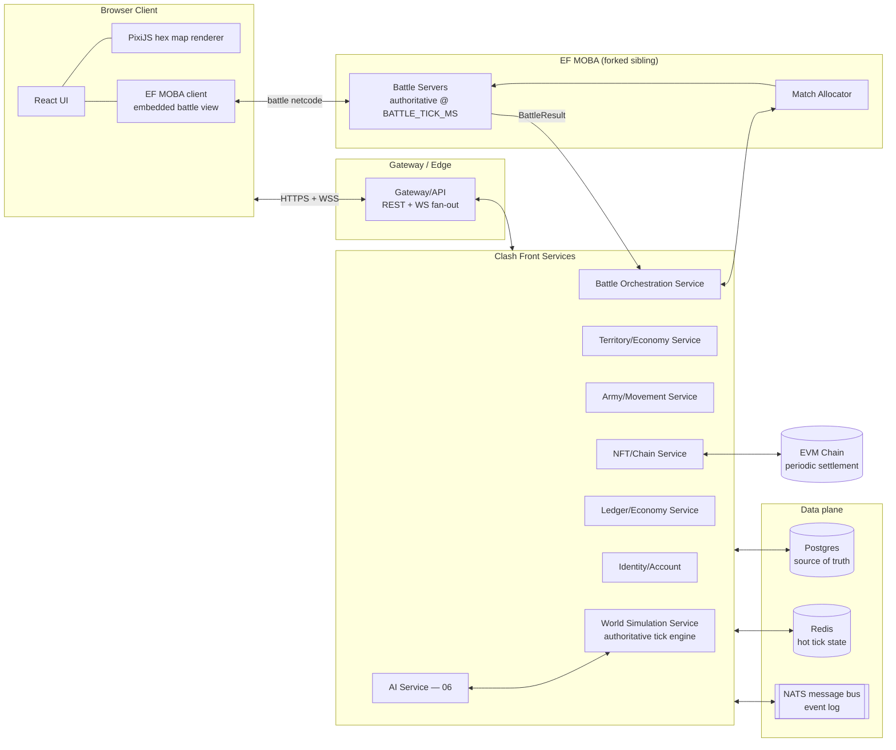
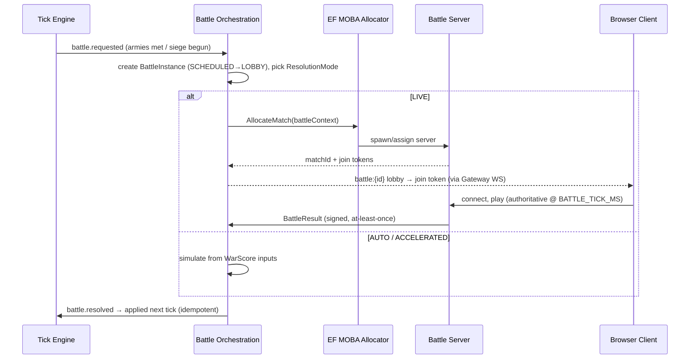

# 07 — Backend Architecture

> Services, the authoritative tick engine, data stores, real-time delivery, and scaling for the
> Clash Front overworld. Schemas, IDs, enums, and invariants are canon in
> [`08-data-models.md`](./08-data-models.md); wire contracts are in [`09-api-contracts.md`](./09-api-contracts.md).
> This doc never redefines those — it says **where they run and who owns them**.

Two facts shape everything here:

1. **Clash Front is a browser game.** The client is a web app; all real-time reaches it over
   WebSockets. There is no trusted client.
2. **Live combat is delivered by EF MOBA**, planned as a **fork of an existing JS/TS MOBA codebase**
   integrated as a sibling in our monorepo. EF MOBA battle servers are authoritative *during* a
   `LIVE` Battle Instance (at `BATTLE_TICK_MS = 100`); the Clash Front world engine is authoritative
   for everything else (at `TICK_SECONDS = 60`). The boundary between the two is the most important
   contract in the system (§7, details in [09](./09-api-contracts.md)).

---

## 1. High-level architecture



Read path: browser → Gateway → Redis-backed reads. Write path: player commands → Gateway →
owning service → **validated, then applied by the tick engine** (never directly). Battle path:
tick engine spawns a Battle Instance → Battle Orchestration → EF MOBA → result event → next tick.

---

## 2. Tech stack

Pragmatic and TypeScript-first, so the MOBA fork, overworld services, shared types
([08](./08-data-models.md) interfaces compile as-is), and client share one language and one monorepo.

| Layer | Choice | Why | Acceptable alternatives |
|---|---|---|---|
| Client UI | React + TypeScript | Ecosystem, hiring, shared types with backend | Vue/Svelte fine; not load-bearing |
| Map renderer | **PixiJS** (WebGL) | Thousands of hexes + moving armies at 60fps; DOM/SVG won't scale; lighter than a full engine for a pannable hex overworld | Phaser if we want built-in tweening/camera; Three.js only if we go 2.5D |
| Battle client | EF MOBA's forked renderer | Comes with the fork | — |
| Services | Node.js 22 + TypeScript (Fastify for HTTP, `ws` for sockets) | Matches the MOBA fork; single toolchain; tick loop is I/O-bound, not CPU-bound (heavy math in worker threads) | Go/Rust for the tick engine later if profiling demands; keep the event contracts identical |
| Relational store | **Postgres 16** | ACID ledger (invariant 1 of 08 §5), relational core, `LISTEN/NOTIFY` as a bonus | Any managed PG (RDS/Cloud SQL/Neon) |
| Hot state | **Redis** | Sub-ms reads of army/territory hot state; per-region hashes; pub/sub for fan-out | KeyDB/Dragonfly drop-in |
| Message bus | **NATS JetStream** | Lightweight, ordered, persistent streams for the world event log; simpler ops than Kafka at our scale | Kafka if analytics volume explodes; the storage-mapping row in [08 §6](./08-data-models.md) permits either |
| Real-time to browser | WebSockets (via Gateway) | Universal browser support, bidirectional | WebTransport later for battle spectating |
| Chain | EVM-compatible, via NFT/Chain Service only | 08 §1 mandates chain-agnostic EVM refs | — |
| Deploy | Kubernetes + Agones (or raw K8s Jobs) for battle servers | Autoscaling ephemeral game servers is a solved problem in Agones | Nomad, ECS |

---

## 3. Service decomposition

Services are **modular monolith first**: one deployable per group at MVP, one process per service by
Beta. Boundaries below are the real contract; deployment granularity is a dial.

| Service | Responsibilities | Data owned (authoritative) | Scaling profile |
|---|---|---|---|
| **Gateway/API** | AuthN termination, REST routing, WS connection registry, per-player rate limiting, snapshot+delta fan-out | WS session registry (Redis) | Stateless, horizontal, CPU on fan-out |
| **World Simulation Service** | The tick engine: advances the world every `TICK_SECONDS`, applies queued commands in canonical order ([01](./01-world-simulation.md)), emits tick events | `World.tick`, tick event stream, command queue | **Single writer per region shard** (§4); scale by sharding, never by replication |
| **Territory/Economy Service** | Territory development, structures, prosperity/food/population updates, tax computation, Pillage/Occupy application | `Territory`, `StructureState`, `Lease` | Runs *inside* the tick as a phase library + a thin query/command API; shards with regions |
| **Army/Movement Service** | March orders, pathfinding over `Hex`/`Route`, supply range & `SUPPLY_BREAK_PENALTY`, morale/desertion | `Army`, `UnitStack`, `SupplyTrain` | Same as above: tick-phase library + API; pathfinding in worker threads |
| **Battle Orchestration Service** | Detects engagements handed from the tick, creates `BattleInstance`, runs lobby, picks `ResolutionMode`, allocates EF MOBA servers, ingests `BattleResult`, runs `AUTO`/`ACCELERATED` sim | `BattleInstance`, `WarScore`, `BattleResult` | Stateless workers + allocator; scales with concurrent battles |
| **AI Service** ([06](./06-ai-architecture.md)) | Governor/Military/Diplomacy/Economy AI for NPC Kingdoms; submits *commands like a player* | AI memory/plans only | Horizontal; think-budget per NPC Kingdom; can lag ticks safely |
| **Ledger/Economy Service** | The **append-only double-entry CT ledger** (08 §4), balance queries, transfers, market/contract escrow | `LedgerEntry`, derived balances | Vertical PG first; partition by account later. Never sharded away from Postgres |
| **NFT/Chain Service** | Land NFT mint/transfer mirroring, wallet linkage, periodic on-chain anchoring/settlement | `LandNFT` chain refs, anchor checkpoints | Low throughput, queue-driven |
| **Identity/Account** | Players, heroes, EF SSO (shared EF account), `efMobaProfileId` linkage, sessions | `Player`, `Hero` | Stateless, horizontal |

Anything that mutates simulated state (`Territory`, `Army`, `BattleInstance`) does so **only via
commands consumed by the tick engine**. The Territory and Army services are best understood as the
tick engine's phase implementations plus their read/command APIs — this keeps the single-writer rule
intact while preserving team/code ownership boundaries.

---

## 4. The authoritative tick engine

### 4.1 Principles

- **Deterministic:** a tick is a pure function `(stateN, commands, seed, tickN) → stateN+1 + events`.
  All randomness derives from `hash(World.seed, tick, entityId)`. Given the event log, any past
  world state is reproducible.
- **Single writer per shard:** each **Region shard** (one or more Regions) has exactly one tick
  worker holding a Redis lease (`shard:{id}:writer`, TTL 2× tick). Nothing else writes hot sim
  state. This eliminates intra-shard races by construction — no locks inside a tick.
- **Commands, not mutations:** player/AI actions arrive as validated commands queued per shard
  (Redis stream), stamped with `applyTick = currentTick + 1`. The tick applies them in canonical
  order; rejected commands emit rejection events.
- **Write-through Redis → Postgres:** the tick reads and writes hot state in Redis (per-region hash
  sets keyed by entity ID), then flushes dirty entities to Postgres in one transaction per shard per
  tick, bumping each entity's `version` (08 §1). Redis is a *cache with a lease*, not a second
  source of truth: on crash, the shard rehydrates from Postgres + replays events since the last
  committed tick.
- **Event sourced:** every tick appends its events (`army.moved`, `battle.spawned`, `tax.collected`,
  `territory.occupied`, …) to a NATS JetStream subject `world.{worldId}.region.{regionId}.tick`.
  This stream *is* the replayable world history (08 §6) and feeds the Gateway's delta fan-out,
  analytics, and disaster recovery.

### 4.2 Tick loop orchestration

Phase order is owned by [01 — World Simulation](./01-world-simulation.md); the engine executes it
verbatim. Sketch:

```ts
// One tick worker per shard. TICK_SECONDS = 60 (CONSTANTS, 08 §2).
async function runShard(shard: Shard) {
  await acquireWriterLease(shard);              // fencing token; renewed each tick
  let state = await hydrateFromPostgres(shard); // + replay events past last checkpoint
  for (;;) {
    const tick = state.world.tick + 1;
    const t0 = Date.now();
    const commands = await drainCommandQueue(shard, tick);   // ordered, validated
    const rng = seededRng(state.world.seed, tick);

    const events: WorldEvent[] = [];
    // ---- ordered phases: canonical sequence lives in 01 ----
    events.push(...applyCommands(state, commands));          // orders become intents
    events.push(...phaseMovement(state, rng));               // armies advance path; arrivals
    events.push(...phaseSupplyAndAttrition(state, rng));     // supply drain, SUPPLY_BREAK_PENALTY, desertion
    events.push(...phaseEconomy(state, rng));                // food, population, prosperity, tax accrual
    events.push(...phaseBattleDetection(state));             // opposing forces met → battle.requested
    events.push(...phaseBattleResults(state, await pollResolvedBattles(shard))); // apply BattleResult (idempotent, §5)
    events.push(...phaseDiplomacyAndContracts(state));       // truce expiry, contract fulfilment
    // AI Service consumes events async and submits commands for tick+1 — it is NOT a phase.

    assertInvariants(state);                                  // 08 §5, hard-fail the tick on violation
    await publishEvents(shard, tick, events);                 // NATS, ordered, at-least-once
    await flushDirtyToPostgres(shard, tick, state);           // one txn; version++ per entity; tick checkpoint
    state.world.tick = tick;

    metrics.tickDuration.observe(Date.now() - t0);
    await sleepUntil(t0 + CONSTANTS.TICK_SECONDS * 1000);     // fixed cadence; log if overrun
  }
}
```

Notes:

- **Tax accrual vs settlement:** `phaseEconomy` accrues tax per Territory in hot state; the
  Postgres flush posts the corresponding `LedgerEntry` rows (Governor/Landlord split) **in the same
  transaction** as the tick checkpoint, so CT conservation (invariant 1) can never straddle a crash.
- **Battle results are an input, not a side effect:** `LIVE` battles resolve asynchronously on EF
  MOBA time; their results are queued and consumed by the *next* tick's `phaseBattleResults`, which
  applies casualties, `WarScore`, and `PostVictoryAction` consequences deterministically.
- **Overruns:** if a tick exceeds `TICK_SECONDS`, we never skip — we log, alert, and start the next
  tick immediately (the world runs slightly late rather than diverging). Persistent overrun ⇒ split
  the shard.

### 4.3 Sharding regions, cross-region consistency

A World is partitioned into **region shards**. Within a shard: single writer, trivially consistent.
Across shards, only three things cross the boundary, and each has an explicit protocol:

| Cross-shard concern | Protocol |
|---|---|
| **Army crossing a region border** | Handoff command: source shard emits `army.handoff{army, targetShard, atTick}` at the border hex, marks the army `state: MARCHING`, frozen. Target shard consumes it and materializes the army at `atTick + 1`. Armies exist in exactly one shard; a one-tick seam at borders is invisible at `TRAVEL_ADJACENT_MIN = 15` minutes per hex. |
| **Battle at a border hex** | The hex's owning shard (deterministic: every `Hex` belongs to one Region) hosts the `BattleInstance`; foreign armies are handed off first, then engage. |
| **CT / ledger** | Never sharded — all CT movements go through the Ledger Service in Postgres, which is region-agnostic. Shards *reference* balances; they never own them. |

Shard count is an ops dial: MVP runs the whole World as one shard (one writer, simplest possible
system); Beta splits by Region cluster. The handoff protocol is in the code from day one so the
split is a config change, not a rewrite.

---

### 4.4 Geographic zone-server mapping (owner, 2026-07-03)

The world map is huge (10 zones, 292,766 parcels) — **active map area is limited by server
capacity, geographically**:

- **Shard unit = zone (or a sub-zone slice of a huge continent).** Each enabled zone is served by
  EXACTLY ONE regional server — **no two servers ever serve the same zone** (this is geographic
  sharding of ONE world, not realm mirroring; there are no duplicate worlds).
- **Server regions follow the existing MOBA footprint**: Montreal (ca) + Singapore (sg) today ⇒
  launch with TWO enabled continents/zones, one per region. More zones unlock as servers are
  added — expansion of the playable world is an infrastructure event (and a marketing one:
  "a new continent opens").
- **One big full world, even cross-server**: every zone is visible on the map to everyone;
  disabled zones render as "beyond the frontier" (visible, not yet playable). Cross-zone travel
  and interaction cross server boundaries via the inter-shard protocol (§4.3) — the player never
  sees a server, only distance. Armies crossing hand off between shard writers.
- **Latency locality for battles**: a zone's battles (command mode + hero mode) run on that
  zone's regional server — fight in the Singapore continent, get Singapore ping. Players
  effectively choose their home latency by choosing where they settle.
- Zone→server assignment is config (`zones.json` ⚙: zoneId → {region, enabled}), changeable only
  by migration procedure (shard writer handoff), never concurrently served.

## 5. Consistency & concurrency

- **Optimistic concurrency:** every mutable simulated entity carries `version` (08 §1). The tick's
  Postgres flush does `UPDATE … SET version = version + 1 WHERE id = $1 AND version = $2`; a miss
  means an out-of-band write happened (bug — only admin tooling may bypass the engine) and the tick
  aborts loudly. Non-simulated rows (NFT listings, leases, player profiles) use the same pattern in
  their owning services.
- **CT is ACID, always:** the ledger is append-only double-entry in Postgres (08 §4). Any operation
  spending CT (build, train, repair, market buy, contract escrow) runs as one transaction:
  `INSERT LedgerEntry` + the domain effect + derived-balance check `≥ 0`. There is no Redis-side CT.
  The tick may *accrue* CT-denominated intent in hot state, but money moves only when Postgres
  commits.
- **Idempotent battle results:** EF MOBA delivers `BattleResult` at-least-once. The orchestrator
  writes it keyed by `battleId` with a state guard (`SCHEDULED|LOBBY|RUNNING → RESOLVED` exactly
  once); duplicates are acknowledged and dropped. Loot posting uses `refId = battleId` on the
  `LedgerEntry` with a uniqueness constraint on `(reason, refId)` — a replayed result cannot
  double-pay (invariant 10 also gates `PostVictoryAction` to once per battle).
- **Authority handoff to EF MOBA:** when a Battle Instance goes `LIVE`, the tick engine freezes the
  participating armies (`state: ENGAGED`) and the contested Territory (`underSiegeBattleId`). During
  the match, EF MOBA is authoritative for everything *inside* the battle; the overworld treats the
  frozen entities as read-only. Authority returns exactly once, via the `BattleResult` event. If a
  battle server dies without reporting, a reconciliation job times the battle out and falls back to
  `AUTO` resolution from the pre-battle `WarScore` — the world never deadlocks on a lost match.

---

## 6. Real-time delivery

Browser clients hold one WebSocket to the Gateway and subscribe to channels:

| Channel | Contents |
|---|---|
| `region:{regionId}` | Everything visible in a region: army movement deltas, battle spawns/lobbies, territory control flips, siege status, prosperity band changes |
| `player:{playerId}` | Private: your tax ticks (CT income), order acks/rejections, contract offers, battle invitations for your Heroes |
| `battle:{battleId}` | Lobby state, countdown, spectator summary (live netcode itself is client ↔ EF MOBA battle server, not this socket) |
| `world:{worldId}` | Low-frequency: seasons, global announcements, war declarations |

**Snapshot + delta model.** On subscribe, the Gateway serves a snapshot from Redis
(`{tick, entities…}`), then streams per-tick deltas derived from the NATS tick events. Every delta
is stamped with `tick`; the client applies them in order. **Reconnection:** client sends
`lastAppliedTick`; if the Gateway's replay buffer (last ~30 ticks per channel in Redis) covers it,
it replays deltas, else it sends a fresh snapshot. Client-side, army positions are interpolated
along `path` between ticks — the sim is 60 s granular ([08 §2](./08-data-models.md)), the *rendering*
is smooth.

Fan-out scales by adding Gateway nodes; each subscribes to NATS once per hot channel and multiplexes
to its local sockets. Message schemas live in [09](./09-api-contracts.md).

---

## 7. EF MOBA integration boundary

EF MOBA is a **forked sibling in the monorepo** (§10), deployed as its own service fleet. Treat it
architecturally as external: versioned contracts, no shared database, no reaching into its internals.
Battle Orchestration is the *only* Clash Front service that talks to it.



The **battle context** handed off includes: `battleId`, `type`, terrain/structure descriptors for
map generation, both sides' effective army strength, supply/morale modifiers, and each
participant's `efMobaProfileId` + hero loadout — with the engine-enforced clamp that hero
contribution to `WarScore` respects `HERO_IMPACT_MAX` regardless of what happens in the match
(invariant 4). The `BattleResult` coming back is exactly the 08 §4 shape. Payload/API/versioning
details are deferred to [09](./09-api-contracts.md); match scheduling and mode selection rules are
in [04](./04-battle-system.md).

Because the fork shares our TypeScript toolchain, the contract types live in a shared package
(`packages/protocol`) imported by both sides — drift becomes a compile error. If EF MOBA later
becomes a fully separate deployment/team, only the transport hardens (signed HTTPS + queue); the
contract is already service-shaped.

---

## 8. Chain / NFT service

Principle: **the chain is a settlement layer, never a game loop dependency.** No per-tick chain
calls, ever (08 §6).

- **CT:** the off-chain double-entry ledger is authoritative (08 §4). The NFT/Chain Service
  periodically (e.g. daily, and on explicit withdrawal) **anchors** a checkpoint: a Merkle root of
  account balances posted on-chain, plus processing of deposit/withdrawal queues that bridge
  on-chain CT ↔ ledger CT (each bridge event is a `reason:'mint'`-class boundary entry, preserving
  invariant 1 conservation on the off-chain side).
- **Land NFTs:** `1 Territory ↔ 1 LandNFT` (invariant 2). Territories start SYSTEM-owned
  (`ownerPlayerId` undefined, per `LAUNCH_NPC_TERRITORY_PCT = 0.95` NPC control at launch); minting
  to chain is **lazy** — an NFT is minted on-chain when first sold/withdrawn to a wallet, otherwise
  it exists only as the Postgres row. Transfers observed on-chain are ingested by an indexer and
  mirrored into `LandNFT.ownerPlayerId` after confirmation depth; the game reads only the mirror.
- **Wallet linkage:** Identity/Account owns `Player.walletAddress`, verified by signature challenge.
  One wallet per player account; relinking is rate-limited and audit-logged (account-takeover surface).
- **Failure isolation:** chain outages degrade only deposits/withdrawals/NFT trades. The world tick,
  tax, and battles are unaffected by design.

---

## 9. Scaling & ops

- **Sharding:** the unit of world scale is the region shard (§4.3). The unit of battle scale is the
  battle server. The unit of fan-out scale is the Gateway node. All three scale independently.
- **Concurrent battles:** battle servers are ephemeral pods (Agones fleet). Autoscale on
  `LOBBY + RUNNING` Battle Instances with a warm buffer sized from prime-time forecasts; `AUTO`
  resolution is the natural backpressure valve — if allocation is exhausted, [04](./04-battle-system.md)'s
  scheduler degrades marginal battles to `AUTO` rather than queueing players.
- **Caching:** Redis hot state doubles as the read cache; Gateway snapshots are cached per
  `(channel, tick)`. Static world geometry (hexes, routes) is a versioned CDN asset — clients fetch
  it once, deltas never include it.
- **Rate limiting:** per-player command budgets at the Gateway (token bucket, e.g. N orders/min)
  plus per-IP connection limits; command validation also enforces game-legal rate (an army takes
  one order per tick meaningfully).
- **Observability:** OpenTelemetry traces from Gateway command → tick application → event
  publication (correlate by `commandId`); metrics with SLO alerts on `tick_duration_seconds`
  (alert at > 0.5 × `TICK_SECONDS`), command queue depth, battle allocation latency, WS fan-out lag,
  ledger balance-vs-sum drift (must be zero); structured logs keyed by `tick` and entity ID.
- **Disaster recovery:** Postgres PITR (WAL archiving) + the NATS event stream mirrored to object
  storage. Recovery = restore Postgres to checkpoint tick T, replay events T→now through the
  deterministic engine. The event log also powers offline replay for debugging and the "world
  history" product feature. Test the replay path in CI on a fixture world — determinism rots if
  unexercised.

---

## 10. Security

- **Authoritative server, hostile client.** The browser sends *intents*; every command is validated
  against hot state (ownership, adjacency, `arrivalTick` legality, CT balance via ledger) before
  entering the queue. Nothing the client sends is a fact.
- **Anti-cheat surface:** overworld cheating is mostly *economic and informational* — fog-of-war
  enforcement server-side (region channels only carry what the subscriber may see, per
  [01](./01-world-simulation.md) visibility rules), order-rate anomalies, multi-account tax farming
  (graph analysis on ledger flows), and AI-assisted botting (behavioral rate limits, not client
  detection). Live-battle anti-cheat is EF MOBA's domain; our `HERO_IMPACT_MAX` clamp bounds the
  blast radius of any battle-side exploit on the macro game.
- **Economy exploit protection:** CT invariant checks (08 §5.1) run as a continuous auditor job over
  the ledger; anomalies freeze the affected accounts, not the world. All mint-class entries require
  a second, non-game-service signer. Battle loot, pillage, and contract payouts are uniqueness-
  constrained by `refId` (§5). Admin mutations go through the same command pipeline with audit trail.
- **Boundary integrity:** battle servers authenticate to Battle Orchestration with per-match signed
  tokens; a battle server can only ever report the one `battleId` it was allocated.

---

## 11. Monorepo layout

Fork the MOBA into the monorepo as sibling apps sharing packages — one toolchain (pnpm workspaces +
Turborepo), one type system, versioned contracts at the seam:

```
etherfantasy-clashfront/
├─ apps/
│  ├─ web/                  # React + PixiJS overworld client (embeds moba-client for LIVE)
│  ├─ gateway/              # Gateway/API: REST + WS fan-out
│  ├─ world-sim/            # tick engine + territory/army phase libraries
│  ├─ battle-orchestrator/  # Battle Instances, EF MOBA allocation, AUTO resolver
│  ├─ ai-service/           # 06 — NPC Kingdom brains
│  ├─ ledger/               # CT ledger + economy APIs
│  ├─ chain/                # NFT/Chain service + indexer
│  ├─ identity/             # accounts, heroes, EF SSO
│  └─ ef-moba/              # ★ the fork: moba-server/, moba-client/, allocator/
├─ packages/
│  ├─ models/               # 08 canonical types, CONSTANTS, invariant asserts
│  ├─ protocol/             # 09 contracts: REST/WS/event schemas + battle handoff types
│  ├─ sim-core/             # deterministic tick phases, seeded RNG, hex math (shared with AUTO resolver & replay tooling)
│  └─ config/               # balance.json loader, env schemas
├─ infra/                   # k8s/Agones manifests, terraform
└─ docs/                    # this bible
```

Rules: `apps/ef-moba` imports `packages/protocol` and nothing else of ours; no Clash Front app
imports EF MOBA internals. Upstream MOBA changes merge into `apps/ef-moba` on its own cadence.
`packages/sim-core` must stay side-effect-free — it is what makes replay, `AUTO` resolution, and the
tick engine share one deterministic brain.

---

## Cross-references

- [`README.md`](./README.md) — glossary, pillars, `HERO_IMPACT_MAX` rationale
- [`01-world-simulation.md`](./01-world-simulation.md) — **canonical tick phase order**, hex/travel/supply rules, visibility
- [`02-economy.md`](./02-economy.md) — tax formulas, prosperity/yield curves the Economy phase implements
- [`03-military.md`](./03-military.md) — army composition, upkeep consumed by the supply phase
- [`04-battle-system.md`](./04-battle-system.md) — battle scheduling, lobby rules, resolution-mode selection
- [`05-pve-integration.md`](./05-pve-integration.md) — EF Hunt hooks riding the same event bus
- [`06-ai-architecture.md`](./06-ai-architecture.md) — AI Service internals; AI acts via the same command queue
- [`08-data-models.md`](./08-data-models.md) — all schemas, `CONSTANTS`, invariants, storage mapping (§6)
- [`09-api-contracts.md`](./09-api-contracts.md) — REST/WS/event bus and EF MOBA handoff contracts
- [`10-development-roadmap.md`](./10-development-roadmap.md) — when the monolith splits, when shards split
