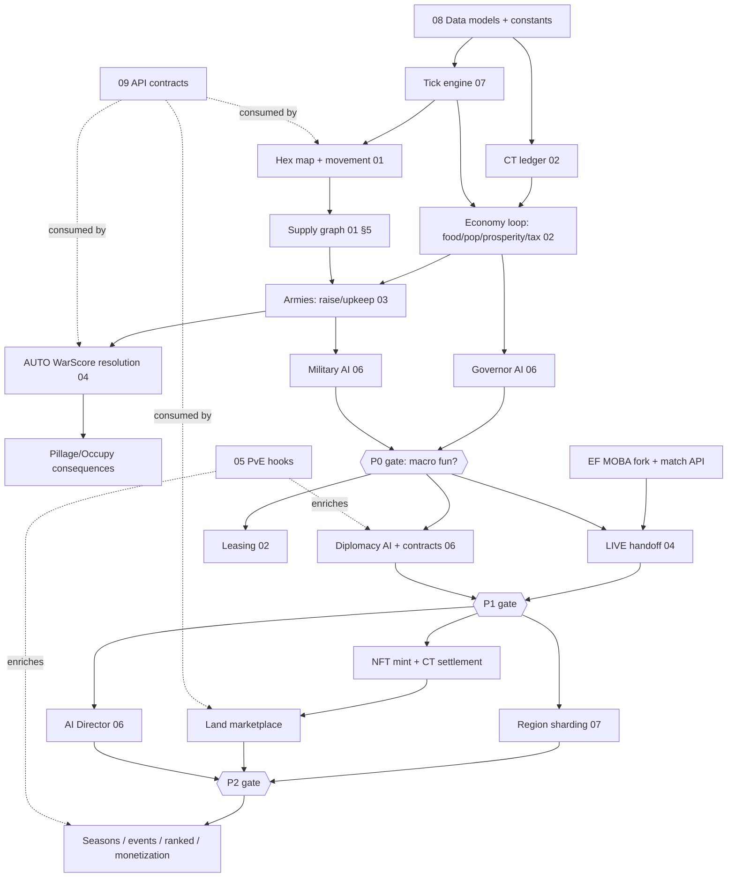

# 10 — Development Roadmap

> Phased delivery plan for Clash Front. Audience: implementation agents and human leads.
> **Guiding principle: prove the MACRO loop before scaling battles.** The overworld must be fun
> with zero live combat before we spend a single sprint on the EF MOBA handoff. This is the
> [North Star](./README.md#design-north-star) expressed as a schedule.

Context assumptions (canon for planning):

- We are likely **forking an existing EF MOBA codebase** — EF MOBA provides `LIVE` battles as a
  service; we never re-implement moment-to-moment combat ([`04-battle-system.md`](./04-battle-system.md)).
- **Map layer assets already exist** elsewhere; **character/hero assets already exist**. This
  roadmap is a **macro-game build-out**: simulation, economy, military, AI, backend, APIs.
- All schemas, constants, and invariants come from [`08-data-models.md`](./08-data-models.md).
  Tuning numbers live in versioned `balance.json` (see 08 §2 OPEN note) — never hardcode.

---

## 1. Phasing overview

| Phase | Codename | Duration (target) | Proves | Battles | Chain |
|-------|----------|-------------------|--------|---------|-------|
| **P0 — MVP / Vertical Slice** | *Ledger & March* | 8–10 weeks | The macro loop is fun **without** the MOBA | `AUTO` only (WarScore sim) | None. CT off-chain ledger; NFTs stubbed as DB rows |
| **P1 — Alpha** | *Drop-In* | +10–12 weeks | Live battle handoff feels seamless; politics has teeth | `AUTO` + `LIVE` via EF MOBA | Still off-chain |
| **P2 — Closed Beta** | *Landfall* | +12–14 weeks | The economy and chain survive real players and adversaries | All modes, at scale | Land NFT mint + periodic CT settlement |
| **P3 — Live / Live-Ops** | *Open World* | Ongoing seasons | The world stays alive for months | All modes + ranked ties | Fully live |

Every phase gate is a **North Star review**: if any exit criterion shows the map becoming wallpaper
for battles, we stop and fix the macro before advancing.

---

## 2. P0 — MVP / Vertical Slice ("Ledger & March")

**Goal:** the smallest world that proves *where armies are, when they arrive, and whether they are
supplied* is a game worth playing. Make-or-break: if internal playtesters don't voluntarily log back
in "for the arrival" ([00 §5](./00-vision-and-product.md#5-session-cadence-async-persistent-world)),
nothing downstream matters.

### In scope

| System | Slice | Doc |
|--------|-------|-----|
| Hex map | 1 Region, ~200–400 hexes, 12–20 Territories, all `ZoneType`s except `SEA`/`HARBOR` optional | [`01`](./01-world-simulation.md) §1–2 |
| Movement | March orders, `arrivalTick`, path resolution, interception windows | [`01`](./01-world-simulation.md) §3 |
| Supply | Supply graph check, per-tick flow, `SUPPLY_BREAK_PENALTY`, supply trains as raid targets | [`01`](./01-world-simulation.md) §5, [`03`](./03-military.md) |
| Economy core | CT ledger (double-entry, off-chain), food, population, prosperity, tax, tax split, 4 development tracks | [`02`](./02-economy.md) |
| Military | Raise army from population + CT, unit classes (3–4 of 7 enough), upkeep, morale, desertion | [`03`](./03-military.md) |
| Battle | `AUTO` resolution **only** via WarScore sim (army/supply/terrain/morale/structures; hero term clamped at `HERO_IMPACT_MAX` even though heroes are stat-stubs) | [`04`](./04-battle-system.md) |
| Post-victory | Pillage vs Occupy choice with full economic consequences (`PILLAGE_INFRA_LOSS`, `PILLAGE_POP_LOSS`) | [`02`](./02-economy.md), [`04`](./04-battle-system.md) |
| NPC AI | 3–5 NPC Kingdoms with basic **Governor AI** (develop, tax, garrison) + **Military AI** (expand, defend, raid) on utility scoring | [`06`](./06-ai-architecture.md) |
| Backend | Tick engine (`TICK_SECONDS = 60`), Postgres + Redis write-through, single shard, single process acceptable | [`07`](./07-backend-architecture.md) |
| API/Client | Minimal REST + polling (WebSocket optional), map render on existing map assets, order UI | [`09`](./09-api-contracts.md) |

### Explicitly out of scope / deferred

- ❌ `LIVE`/`ACCELERATED` resolution, EF MOBA integration of any kind
- ❌ On-chain anything (CT ledger is off-chain authoritative; `LandNFT` rows exist with `chainId` unset)
- ❌ Diplomacy AI, contracts, mercenaries, leasing (stances may exist as hardcoded `WAR`/`NEUTRAL`)
- ❌ Seasons/weather, fog of war (full visibility OK for the slice), naval, PvE/EF Hunt hooks
- ❌ Guilds/alliances, marketplace, monetization, region sharding, anti-cheat

### Exit criteria / Definition of Done

- [ ] All ten [08 §5 invariants](./08-data-models.md#5-invariants-must-always-hold) enforced with automated per-tick checks; 72-hour unattended NPC-only soak with zero invariant violations
- [ ] A new tester can: settle/seize a territory → develop it → raise an army → march (real travel time) → win an `AUTO` battle → choose Pillage or Occupy → collect tax — in one guided session
- [ ] Cutting a supply line demonstrably flips a battle a stronger army "should" win (the [`01` §5](./01-world-simulation.md) counterplay works)
- [ ] NPC kingdoms visibly fight each other and territory changes hands **without any player input**
- [ ] Playtest survey: ≥ 60% of internal testers return unprompted next day to "check on their march/territory"
- [ ] **KPI proxies** ([00 §8](./00-vision-and-product.md#8-success-metrics-macro-game-kpis)): median session ≥ 4 loop actions / 10 min; territory turnover in-band (3–8%/wk scaled); CT sink/source ratio 0.9–1.1 over the soak

---

## 3. P1 — Alpha ("Drop-In")

**Goal:** bolt the mastery layer onto a proven macro game, and give the world politics.

### In scope

| System | Addition | Doc |
|--------|----------|-----|
| Battle | `LIVE` handoff to EF MOBA: `LOBBY` phase, drop-in heroes, `efMobaMatchId` linkage, result ingestion, WarScore reconciliation with `HERO_IMPACT_MAX` clamp; `ACCELERATED` mode; defender-offline scheduling windows | [`04`](./04-battle-system.md) |
| MOBA fork | Fork/adapter work on the EF MOBA codebase: match provisioning API, battle-context injection (terrain, army strength → match modifiers), result callback | [`04`](./04-battle-system.md) |
| Heroes | Real hero records linked to `efMobaProfileId`; fame, titles, equipment (cosmetic-impact within cap) | [`08`](./08-data-models.md) §4 |
| Diplomacy | Full `DiplomacyStance` machine, **Diplomacy AI**, Contract board (all five `ContractType`s), mercenary loop | [`06`](./06-ai-architecture.md) |
| Economy | Leasing (`Lease`), richer sinks: repair (siege damage), contract fees, route/structure maintenance; **Economy AI** for NPC trade | [`02`](./02-economy.md) |
| World | 3–4 Regions incl. `SEA`/`HARBOR` + naval movement; seasons & weather modifiers; fog of war & scouting | [`01`](./01-world-simulation.md) §8–9 |
| PvE | `WILD` zone hooks, first world-boss event, EF Hunt tie-in stubs | [`05`](./05-pve-integration.md) |
| Backend | WebSocket real-time at **scale-lite** (hundreds of concurrent), event bus (Kafka/NATS) for world history, service extraction from the P0 monolith where hot | [`07`](./07-backend-architecture.md), [`09`](./09-api-contracts.md) |

### Out of scope / deferred

- ❌ On-chain mint/settlement, marketplace
- ❌ Region sharding, thousands-concurrent load
- ❌ Guild/alliance *governance tooling* (guilds can exist as governor entities; no internal politics UI)
- ❌ Full AI Director / anti-stagnation meta-layer (basic per-kingdom AI only)
- ❌ Monetization

### Exit criteria / DoD

- [ ] End-to-end `LIVE` flow: battle scheduled on the map → lobby → EF MOBA match → result changes the map, < 2 min end-to-end overhead, zero orphaned `BattleInstance`s across a 500-battle soak
- [ ] The same battle resolved `AUTO` vs `LIVE` with identical inputs lands within a designed variance band — heroes swing outcomes, never > 20% (invariant 4 verified statistically)
- [ ] Mercenary/bounty contracts are posted, taken, and fulfilled by both players and NPC AI
- [ ] ≥ 1 lease executed where landlord ≠ governor and both profit (Pillar 11 live)
- [ ] **KPIs** ([00 §8](./00-vision-and-product.md#8-success-metrics-macro-game-kpis)): `LIVE` ratio lands in 10–25% of battles organically; war participation ≥ 30% WAU; non-combat earners ≥ 15% (ramping toward 25%)

---

## 4. P2 — Closed Beta ("Landfall")

**Goal:** real players, real ownership, real adversaries. Harden the economy and the chain.

### In scope

| System | Addition | Doc |
|--------|----------|-----|
| Chain | Land NFT minting (1:1 `Territory ↔ LandNFT`, invariant 2), periodic CT settlement anchoring (not per-tick), wallet linking | [`02`](./02-economy.md), [`08`](./08-data-models.md) §6 |
| Marketplace | Land listing/sale (`listedForSalePriceCt`), lease marketplace, SYSTEM-owned supply management | [`02`](./02-economy.md) |
| Social | Guild/alliance governance: shared treasuries, governorship voting, alliance-level diplomacy | [`06`](./06-ai-architecture.md), [`09`](./09-api-contracts.md) |
| Scale | Region sharding of the tick engine, hot/cold state tuning, load tests at target CCU | [`07`](./07-backend-architecture.md) |
| Integrity | Anti-cheat/anti-exploit: ledger audits (CT conservation, invariant 1), multi-account/RMT detection, order-rate limits, battle-result verification against EF MOBA | [`07`](./07-backend-architecture.md) |
| AI | Full **AI Director**: anti-stagnation (NPC coalitions vs runaway leaders, frontier reheating, collapse/succession events) | [`06`](./06-ai-architecture.md) |
| Ops | Telemetry → warehouse → balancing pipeline; `balance.json` hot-reload retuning loop; KPI dashboards wired to [00 §8](./00-vision-and-product.md#8-success-metrics-macro-game-kpis) |

### Out of scope / deferred

- ❌ Public launch, open registration, marketing beats
- ❌ Ranked/competitive EF MOBA ties, creator tools
- ❌ Monetization storefront (cosmetics may be granted for testing, not sold)

### Exit criteria / DoD

- [ ] 100% of territories minted; zero orphaned NFT/territory pairs; chain settlement replayable from `LedgerEntry` log with exact conservation
- [ ] Load test at 5–10× expected launch CCU with tick p99 < `TICK_SECONDS` budget and no cross-shard invariant breaks
- [ ] Red-team pass: no found exploit yields > trivial CT/day; dupes impossible by construction (append-only ledger)
- [ ] AI Director demonstrably prevents stagnation over a 30-day beta: no single governor exceeds map-share ceiling without coalition response; NPC share stays ≥ floor per [00 §8](./00-vision-and-product.md#8-success-metrics-macro-game-kpis)
- [ ] **KPIs at genre-competitive band**: D1/D7/D30 ≥ 45/22/10%; territory turnover 3–8%/wk; sink/source 0.9–1.1 over 30 days; non-combat earners ≥ 25%

---

## 5. P3 — Live / Live-Ops ("Open World")

**Goal:** the world never resets; keep it worth living in.

| Track | Content | Doc |
|-------|---------|-----|
| Seasonal cadence | Season = narrative arc + rule modifiers + fresh frontier regions; the map persists across seasons (Pillar 6) | [`01`](./01-world-simulation.md) §8, [`00`](./00-vision-and-product.md) |
| World events | World bosses, invasions, EF Hunt crossover story beats populating `WILD` zones | [`05`](./05-pve-integration.md) |
| Competitive | Ranked ties to EF MOBA: fame/title pipelines, showcase sieges, tournament territories | [`04`](./04-battle-system.md) |
| Balance | Ongoing retune purely via versioned `balance.json` + telemetry; code changes are for features, not numbers | [`08`](./08-data-models.md) §2 |
| Community | Creator tools: map replays from the event log, war-history APIs, alliance pages | [`09`](./09-api-contracts.md) |
| Monetization | Live per [00 §7](./00-vision-and-product.md#7-monetization--web3--principled-and-specific): land, cosmetics, equipment-within-cap, contract fees. Every SKU passes the anti-P2W firewall review |

**Standing DoD per release:** KPI dashboard green or trending green; North Star review passed;
zero invariant violations in canary; rollback plan tested.

---

## 6. Dependency graph / critical path

**Critical path:** `08 data models → tick engine → economy → military → AUTO battle → NPC AI → P0
gate → MOBA handoff → P1 gate → chain → P2 gate`. The **EF MOBA fork** is the one long-lead item
*off* the P0 path — start it in parallel during P0 (Battle agent) so it doesn't block P1, but never
let it pull effort from the macro slice.

---

## 7. Workstreams & synchronization (agent roles per [README](./README.md#how-to-read-this-bible))

| Workstream (agent) | P0 | P1 | P2 | Hard sync points |
|--------------------|----|----|----|------------------|
| **Sim** (01) | Hex map, movement, supply, tick semantics | Seasons, fog, naval | Shard-safe sim | Owns `arrivalTick`/supply APIs consumed by Military & AI |
| **Economy** (02) | Ledger, tax/prosperity loop, pillage math | Leases, sinks | Chain settlement, marketplace | Ledger schema freeze end of P0-wk2; every phase's sink/source audit |
| **Military** (03) | Raise/upkeep/morale, supply trains | Naval units, veterancy | Balance passes | Consumes Sim supply graph; feeds Battle army snapshots |
| **Battle** (04) | WarScore `AUTO` resolver | **MOBA fork + LIVE handoff** (starts during P0) | Result verification/anti-cheat | Handoff contract with EF MOBA team frozen before P1-wk4 |
| **AI** (06) | Governor + Military AI | Diplomacy + Economy AI | AI Director | Needs stable order APIs from Sim/Military/Economy — AI is always one interface-freeze behind |
| **Backend** (07) | Tick engine, PG+Redis, single shard | Event bus, WebSocket, service split | Sharding, load, integrity | Tick engine contract is the first freeze (P0-wk2) |
| **API** (09) | Minimal REST + polling | WS real-time contracts | Marketplace/guild APIs, public docs | Versioned contracts gate every client feature |
| **PvE** (05) | — (idle; may prototype `WILD` spawns) | Wild zones, world boss | EF Hunt crossover | Joins at P1; consumes Sim node/hex APIs |
| **Product** (00) | Playtest design, KPI proxies | KPI instrumentation | Beta program, dashboards | Runs every phase-gate North Star review |

**Parallelization rule:** agents may work concurrently once `08` interfaces they consume are frozen.
Schema changes go through `08-data-models.md` first (canon rule), then fan out. Weekly integration
tick-soak (all systems, NPC-only world, 24h) is the standing sync ritual from P0-wk3 onward.

---

## 8. Risk-based sequencing

Attack the riskiest assumptions first; each has a scheduled kill-or-confirm moment.

| # | Risky assumption | Test | When | If false |
|---|------------------|------|------|----------|
| 1 | **The macro loop is fun without the MOBA** | P0 vertical slice, `AUTO`-only playtests | P0 gate | Redesign loop; do **not** proceed to P1 — a MOBA cannot save a boring map ([00 §9](./00-vision-and-product.md#9-risks--mitigations) "Macro ignored") |
| 2 | **Travel time + supply create strategy, not tedium** | Instrument P0: do testers plan around arrivals/supply cuts, or AFK? | P0 wk6 | Retune `TRAVEL_*` constants in `balance.json`; add order queueing/automation before adding content |
| 3 | **NPC kingdoms make the world feel alive** | 72h NPC-only soak reviewed as a "story" | P0 wk8 | Deepen utility AI before scaling map size |
| 4 | **MOBA handoff feels seamless** | First E2E `LIVE` prototype with fake macro context | P1 wk4 | Fall back to `ACCELERATED`-first design; renegotiate EF MOBA API |
| 5 | **Hero cap holds under real players** | Statistical audit of `LIVE` outcomes vs `HERO_IMPACT_MAX` | P1 gate | Retune WarScore weights; this is a launch blocker |
| 6 | **Economy doesn't inflate with real greed** | Closed beta 30-day sink/source tracking + red team | P2 | Add sinks (repair, fees); throttle sources; chain settlement waits |
| 7 | **Chain adds value without adding friction** | Beta cohort A/B on wallet-linked vs custodial | P2 | Keep chain as optional settlement layer, not a login wall |

---

## 9. First 2 weeks — starter task list (implementation agents)

Ordered; `[blocked by]` noted. Target: a fake world that ticks, and one hand-playable territory loop.

**Week 1 — skeleton**
- [ ] **T1 (Backend):** Bootstrap monorepo: `packages/{core,sim,economy,military,battle,ai,api}`, `apps/{server,client}`, shared TS config, CI (lint, typecheck, test), `docker-compose` for Postgres + Redis
- [ ] **T2 (Backend/Data):** Implement `08` canon as code: `CONSTANTS`, enums, entity interfaces, ULID id helpers, migrations for Player/Hero/World/Region/Hex/Territory/LandNFT/Army/LedgerEntry `[T1]`
- [ ] **T3 (Backend):** Tick engine skeleton: fixed `TICK_SECONDS` loop, ordered phase pipeline per [`01` §6](./01-world-simulation.md) (movement → supply → economy → battles → AI), Redis hot state with PG write-through, per-tick invariant checker (all 10 from [08 §5](./08-data-models.md#5-invariants-must-always-hold)) `[T2]`
- [ ] **T4 (Economy):** Double-entry CT ledger: `LedgerEntry` append, balance derivation, conservation audit job, `mint` bootstrap `[T2]`
- [ ] **T5 (Sim):** Hex math lib (axial coords, adjacency, A* with `moveCost`) + **fake-world seed script**: 1 region, ~200 hexes, 12 territories across ZoneTypes, 3 NPC kingdoms, seeded from `World.seed` for reproducibility `[T2]`
- [ ] **T6 (Product):** Stand up `balance.json` v0 with initial tuning values + loader; wire KPI proxy logging into the event stream `[T1]`

**Week 2 — one playable loop**
- [ ] **T7 (Economy):** Territory tick: food production/consumption, population growth/starvation, prosperity update, tax → treasury + landlord split (`TAX_SPLIT_LANDLORD_DEFAULT`) `[T3,T4,T6]`
- [ ] **T8 (Military):** Raise army order (population + CT → `UnitStack`s), upkeep (food/CT per tick), morale + `DESERTION_MORALE_THRESHOLD` `[T7]`
- [ ] **T9 (Sim):** March order: path resolution, `arrivalTick`, `MARCHING` state machine; supply graph check + per-tick supply flow + `SUPPLY_BREAK_PENALTY` flag `[T5,T8]`
- [ ] **T10 (Battle):** WarScore `AUTO` resolver v0 (army/supply/terrain/morale/structures; hero term stubbed at 0 but clamp code path present); Pillage/Occupy application with `PILLAGE_*` constants `[T9]`
- [ ] **T11 (AI):** Governor AI v0 (develop/garrison by utility score) + Military AI v0 (expand toward weakest adjacent) for the 3 NPC kingdoms `[T10]`
- [ ] **T12 (API/Client):** REST v0 per [`09`](./09-api-contracts.md): world/territory/army reads, march + raise + develop + post-victory orders; render existing map assets with territory overlay and army positions (polling OK) `[T9]`
- [ ] **T13 (All):** First integration soak: 24h NPC-only run, zero invariant violations, then first human playtest of the loop: develop → raise → march → `AUTO` battle → pillage/occupy → tax `[T11,T12]`

Definition of done for the fortnight: **T13 passes** and a developer can play one full territory
loop against NPC kingdoms in the browser.

---

## Cross-references

- [`README.md`](./README.md) — North Star, 11 Macro Pillars, glossary, agent-role doc table
- [`00-vision-and-product.md`](./00-vision-and-product.md) — KPIs (§8) targeted by every phase gate; risks (§9) driving §8 sequencing; monetization principles gating P3
- [`01-world-simulation.md`](./01-world-simulation.md) — map/movement/supply/tick systems scoped in P0; seasons, fog, naval in P1
- [`02-economy.md`](./02-economy.md) — economy core (P0), leases/sinks (P1), chain settlement & marketplace (P2)
- [`03-military.md`](./03-military.md) — armies/upkeep/supply trains (P0)
- [`04-battle-system.md`](./04-battle-system.md) — `AUTO` WarScore (P0), EF MOBA `LIVE` handoff (P1), ranked ties (P3)
- [`05-pve-integration.md`](./05-pve-integration.md) — wild zones/world bosses entering at P1, seasonal events at P3
- [`06-ai-architecture.md`](./06-ai-architecture.md) — Governor/Military AI (P0), Diplomacy/Economy AI (P1), AI Director (P2)
- [`07-backend-architecture.md`](./07-backend-architecture.md) — tick engine (P0), event bus/WS (P1), sharding & integrity (P2)
- [`08-data-models.md`](./08-data-models.md) — canon schemas/constants/invariants; every checklist above cites its invariants
- [`09-api-contracts.md`](./09-api-contracts.md) — REST v0 (P0), WebSocket real-time (P1), marketplace/guild/public APIs (P2+)
- [`AGENTS.md`](./AGENTS.md) — agent conventions and task-graph mechanics used by §7 and §9
